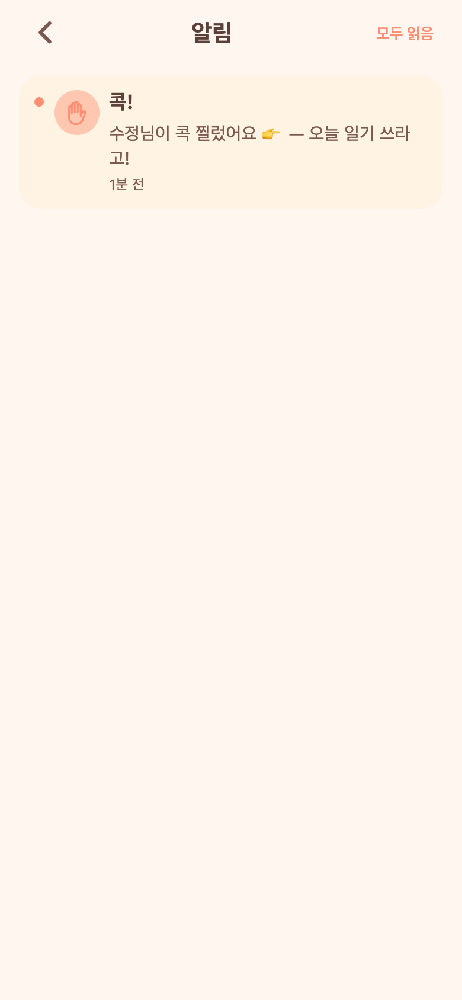
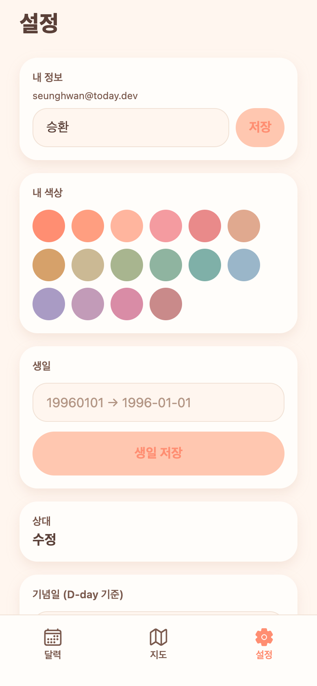
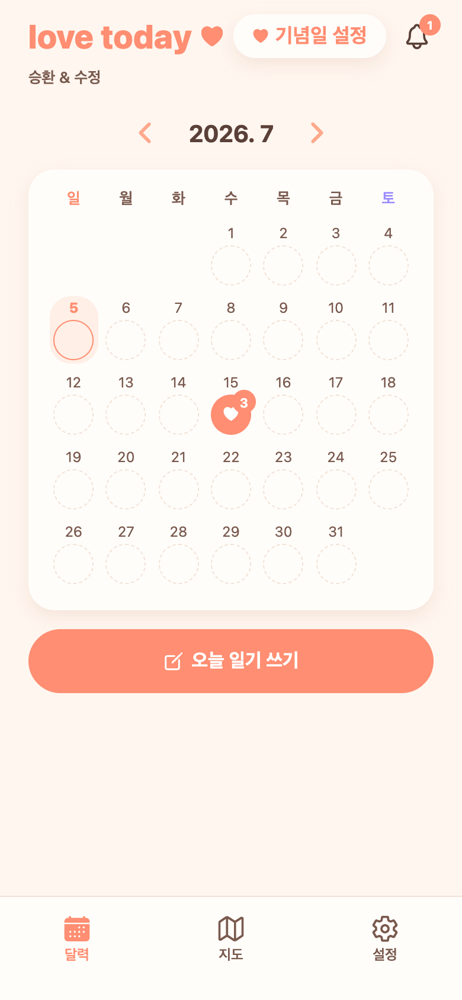
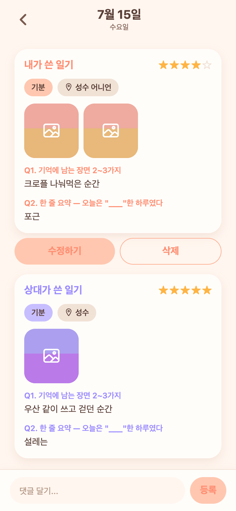

# 09 · 인앱 알림 + UX 대규모 개선 배치

**날짜**: 2026-07-05
**목표**: 실사용 피드백 다수를 한 번에 — 알림 시스템, 화면 캐싱, 여러 버그, 작성/상세/설정 개선. (서브에이전트 웨이브로 진행)

## 웨이브1 — 알림·캐싱·복귀버그 + 백엔드 배치
- **인앱 알림**: 백엔드 알림 도메인(PARTNER_WROTE/ENTRY_OPENED/COMMENT/POKE/ANNIVERSARY/**COUPLE_CONNECTED**) + 프론트 벨·미읽음 뱃지·알림목록·**콕 찌르기**·폴링(focus+45s+AppState).
- **당겨서 새로고침**(RefreshControl), **앱 전반 캐싱(SWR)**: 캘린더 월이동·상세 진입/복귀 시 캐시 즉시표시+백그라운드 갱신 → **깜빡임 제거**, 변경 시 무효화.
- **버그: 백그라운드 복귀 백지** — 복귀 시 bootstrap 재실행 금지·데이터만 refetch + ErrorBoundary.
- **백엔드**: 커플연결 알림, 다중 장소(`diary_entry_locations`)+`GET /api/locations` 이전장소 추천, **기분·별점 필수**, 프로필 색상/생일 API.

## 웨이브2 — 작성폼·상세·캘린더·설정
- **작성**: "기억에 남는 장면 2~3가지" **다중 입력(장면 1/2/3)**, multiline **줄 겹침 버그 수정**(자동높이+lineHeight), **기분·별점 필수 UI**, **장소 칩 다중 입력 + 이전 장소 추천**.
- **상세**: **사진 크게 보기**(풀스크린 뷰어·스와이프), **댓글 키패드 가림 수정**(KeyboardAvoidingView+자동스크롤), 장소 다중 표시.
- **캘린더**: 오늘 하트 스티커 **보라 → 코럴**.
- **설정**: **내 색상 16색 선택**, **생일 등록**.

## 검증 (실제 캡처)
| 알림 목록 (콕! POKE) | 설정 (16색 + 생일) |
|---|---|
|  |  |

| 홈 (벨+미읽음 뱃지) | 상세 |
|---|---|
|  |  |

- 백엔드 E2E(연결알림·필수검증·다중장소·locations·poke) + 프론트 tsc 0 + 실제 렌더 확인.
- 통합 중 발견·수정: 프론트 poke 경로 오류(`/api/notifications/poke`→`/api/poke`).
- 별개: gymtracker/muscle game Expo Go 로그인 오류 = 공유 백엔드(8080) 다운 → 재기동으로 해결.
- 커밋: 웨이브1 `a16a922`, 웨이브2 이 커밋.
