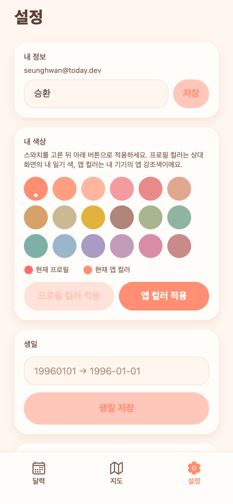

# 10 · 날짜변경·기념일보기·로그인·색상테마 + 지도 목업

**날짜**: 2026-07-05
**목표**: 실사용 피드백 추가 배치 — 일기 날짜 변경, 기념일 목록, 로그인 유지, 앱/프로필 컬러 커스텀, 지도 기능 설계.

## 반영
- **#3 일기 날짜 변경**: 상세에서 날짜 변경(YYYY-MM-DD 마스킹) → `PUT /api/entries/{date}/move`. 미래 400·점유 409·커플스코프.
- **#4 기념일 보기**: 설정 "기념일 보기" → `app/anniversaries` (100일 단위·N주년·양쪽 생일, 다가오는 순). 백엔드 `GET /api/couple/anniversaries`.
- **#5 로그인 자주 풀림**: JWT access TTL 60분 → **30일**(둘만 쓰는 앱).
- **#6 설정 입력 키패드 가림**: 설정 KeyboardAvoidingView+ScrollView+포커스 자동 스크롤.
- **#7 색상 커스텀**: 팔레트 16→**18색**. **[프로필 컬러 적용]**=avatarColor(서버, 상대도 봄), **[앱 컬러 적용]**=앱 전체 강조색(내 기기 로컬, 동적 테마 `useColors()`+`useThemeStore` AsyncStorage). 현재 적용색 표시.
- **지도 기능 설계**: Kakao Map 확정, 목업 3버전([planning/10-map](../planning/10-map.md)) → **A 핀맵** 채택.
- 통합 중 수정: 동적테마 순환참조(useThemeStore↔theme.ts) 런타임 백지 버그 → 기본색 리터럴화로 해결.

## 검증 (실제 캡처)
| 설정 · 18색 + 앱/프로필 컬러 적용 |
|---|
|  |

- 백엔드 E2E(move 200/400/409/404, anniversaries) + 프론트 tsc 0 + 실제 렌더 확인(순환참조 수정 후 pageerror 0).
- 커밋: 앞선 `7c33ee3`(#3·4·5·지도목업) + 이 커밋(#6·7·순환참조).
