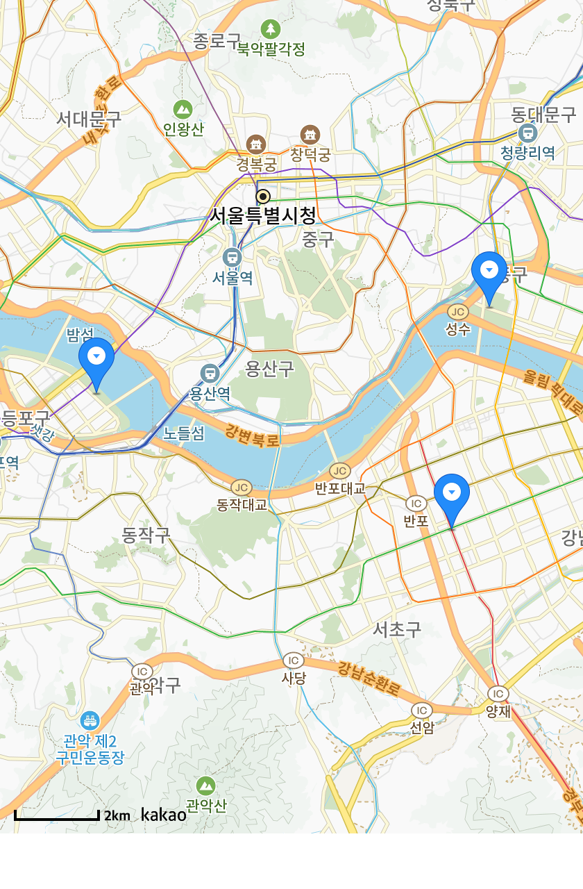
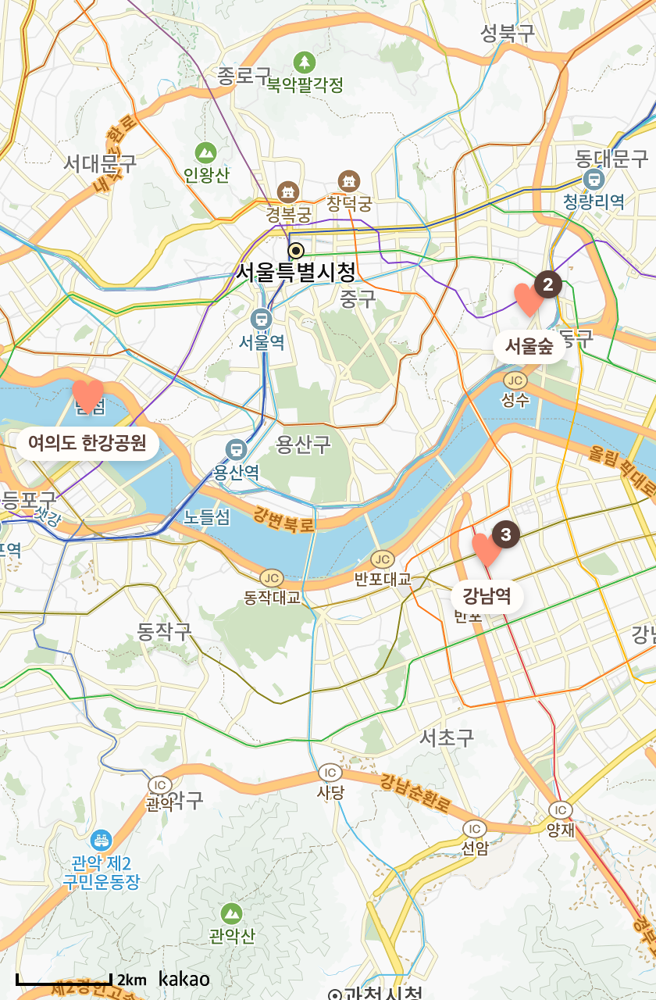

# 11 · 지도 구현 — Kakao Map 연동(키 발급·도메인·렌더 검증)

**날짜**: 2026-07-05
**목표**: [10번](10-date-anniv-colors-map.md)에서 설계한 **A 핀맵**을 실제로 붙인다 — Kakao 개발자 앱 등록·JavaScript 키 발급·도메인 등록·카카오맵 활성화 후, 앱에 키를 넣고 렌더링까지 확인.

## 반영
- **Kakao 개발자 콘솔**(앱 `love today`, ID 1504248):
  - 앱 생성 → **JavaScript 키** 발급.
  - **JavaScript SDK 도메인** 등록: `https://today-web.hammerslog.trade`, `http://localhost:8087`.
  - **카카오맵** 제품 사용 설정 ON(로컬 API=주소/키워드 검색 포함).
- **앱 연동**:
  - `app.json` `extra.kakaoJsKey`에 발급 키 반영(`lib/config.ts`가 `EXPO_PUBLIC_KAKAO_JS_KEY` > `extra.kakaoJsKey` 순으로 읽음).
  - `components/KakaoMap.tsx`: WebView `source`에 **`baseUrl`(등록 도메인)** 지정. `source.html`만 주면 origin이 `about:blank`라 Kakao SDK의 Referer 도메인 검사에서 거부됨 → baseUrl로 Referer를 맞춰 통과.

## 검증 (실제 렌더)
등록 도메인 Referer로 SDK HTML을 로드해 확인:
- `sdk.js` **200**, 주소/키워드 검색 **200**.
- 콘솔: `SDK_LOADED → MAP_CREATED → PIN(강남역·서울숲·여의도 한강공원) → DONE pinned=3`.
- 지도 타일 + 코럴 핀 정상 표시.

- tsc 0. 커밋: `Wire up Kakao Map: JS key + SDK domain referer`.

## 추가 반영 — A안 목업 보강(방문횟수 뱃지 · 토글 위치)
목업 A안과 실제 구현을 비교해, 사용자가 고른 2가지를 마저 채움.
- **방문횟수 뱃지**: 핀 우상단에 그 장소에 다녀온 **날짜 수**(방문 2회 이상만) 다크 뱃지. 리스트엔 "N회" 칩, 상세 시트엔 "우리가 N번 다녀온 곳" 문구.
  - 백엔드: `GET /api/locations` 응답에 `counts:[{name,count}]` 추가. `count=distinct day` 기준(두 사람이 같은 날 같은 곳 적어도 1). JPQL 인터페이스 프로젝션.
- **토글 위치**: 지도/리스트 전환을 상단 우측 아이콘 → **지도 위 하단 중앙 플로팅 알약**(목업 그대로). 검색창은 전체 폭.

- 검증: 백엔드 재기동 후 `GET /api/locations` → `counts` 정상 반환(런타임 200). 프론트 tsc 0. 핀 뱃지 렌더 확인(위 캡처).
- 남은 것: Expo Go(폰) 실기기에서 지도 탭 최종 확인.
