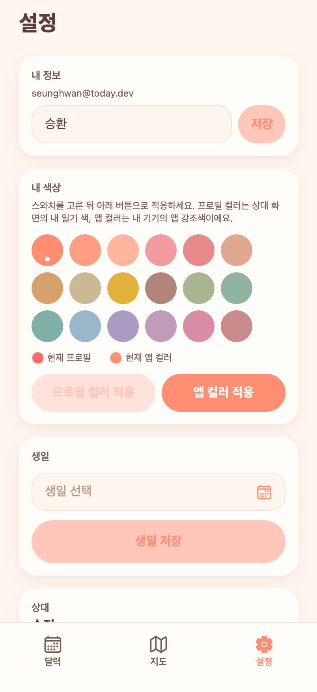
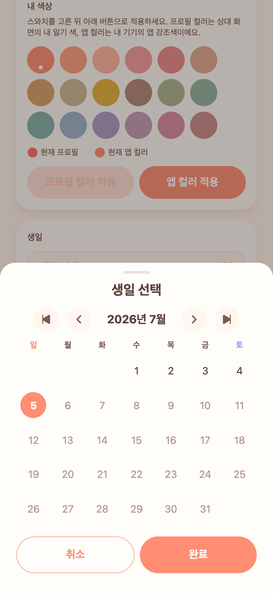
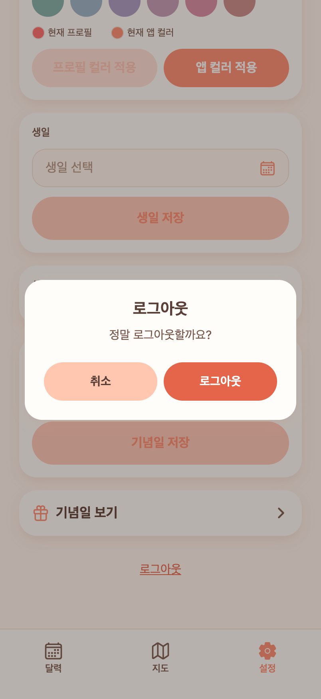

# 12 · 앱 톤 팝업 + 캘린더 날짜 피커 (기본 UI 교체)

**날짜**: 2026-07-05
**목표**: iOS 기본 회색 알림·숫자 키패드가 앱(코럴&크림)과 안 맞는 문제 해결. 사용자 요청 — "팝업을 앱 UI에 맞게", "숫자 키패드도 앱 톤 + 완료 버튼", "날짜는 캘린더 띄워서".

## 반영
- **커스텀 알림(AppAlert)**: 전역 `useAlertStore` + 최상위 `<AppAlert/>`. `lib/dialog.ts`의 `confirmAsync`/`showAlert`가 네이티브 `Alert` 대신 이 스토어를 구동 → 앱 어디서든 코럴&크림 팝업. 버튼 1개=알림, 2개=취소/확인(코럴필), destructive=danger색.
- **캘린더 날짜 피커(DatePickerSheet)**: 하단 시트 캘린더. ⏮‹ 연/월 →›⏭ 네비, 일~토 헤더(일=코럴·토=퍼플), 오늘=코럴 원, `maxDate` 이후는 흐림·선택불가, **완료/취소** 버튼. 홈 `CalendarGrid`와 톤 통일.
- **날짜 입력 3곳 → 피커로 교체**: 설정 **생일**·**기념일**, 일기 상세 **날짜 변경**. 기존엔 텍스트필드+OS 숫자패드였음. 탭하면 캘린더가 뜨고 미래 날짜는 막음(`maxDate=오늘`).
  - 참고: 앱의 숫자 입력이 전부 "날짜"였어서, 별도 커스텀 넘패드 없이 캘린더 피커(완료 버튼 포함)로 요청을 모두 충족.

## 검증 (Expo Web + Playwright, 실제 렌더)
| 날짜 필드 | 캘린더 피커 | 커스텀 팝업 |
|---|---|---|
|  |  |  |

- pageerror 0, tsc 0. 커밋: `Themed alert popup + calendar date picker`.
