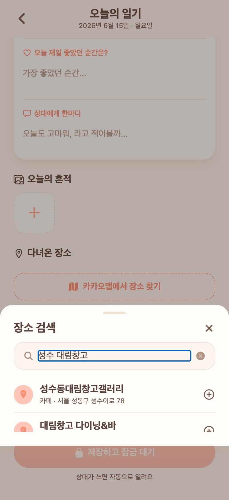

# 13 · 일기 작성 — 카카오맵 장소 검색

**날짜**: 2026-07-05
**목표**: 일기 작성 시 "다녀온 장소"를 직접 타이핑 대신 **카카오맵에서 검색해 추가**. 실제 상호명·주소로 기록.

## 반영
- **백엔드 프록시** `GET /api/places?query=`: 카카오 로컬 REST 키워드 검색을 서버에서 호출하고(`app.kakao.rest-key`, 클라이언트 미노출) `{name,address,category}`로 간소화해 반환. 실패는 빈 배열(작성 흐름 안 막음). 인증 필요.
- **프론트 `KakaoPlaceSearch` 시트**: 하단 시트 + 검색 입력(디바운스 350ms) + 결과 목록(코럴 핀·상호·카테고리·주소). 탭하면 "다녀온 장소" 칩으로 추가. 이미 추가된 곳은 체크 표시.
- **작성 화면 연결**: "다녀온 장소"에 점선 코럴 **[카카오맵에서 장소 찾기]** 버튼 추가. 기존 직접 입력은 보조로 유지.

## 검증 (실제)
- 백엔드: `/api/places?query=성수 대림창고` → `성수동대림창고갤러리`(카페)·`대림창고 다이닝&바` 등 실제 결과. 빈 쿼리=빈 배열, 무인증=401.
- 프론트(Expo Web): 버튼→시트→검색 결과 렌더 확인(pageerror 0, tsc 0).

- 커밋: `Kakao place search for diary location`.
