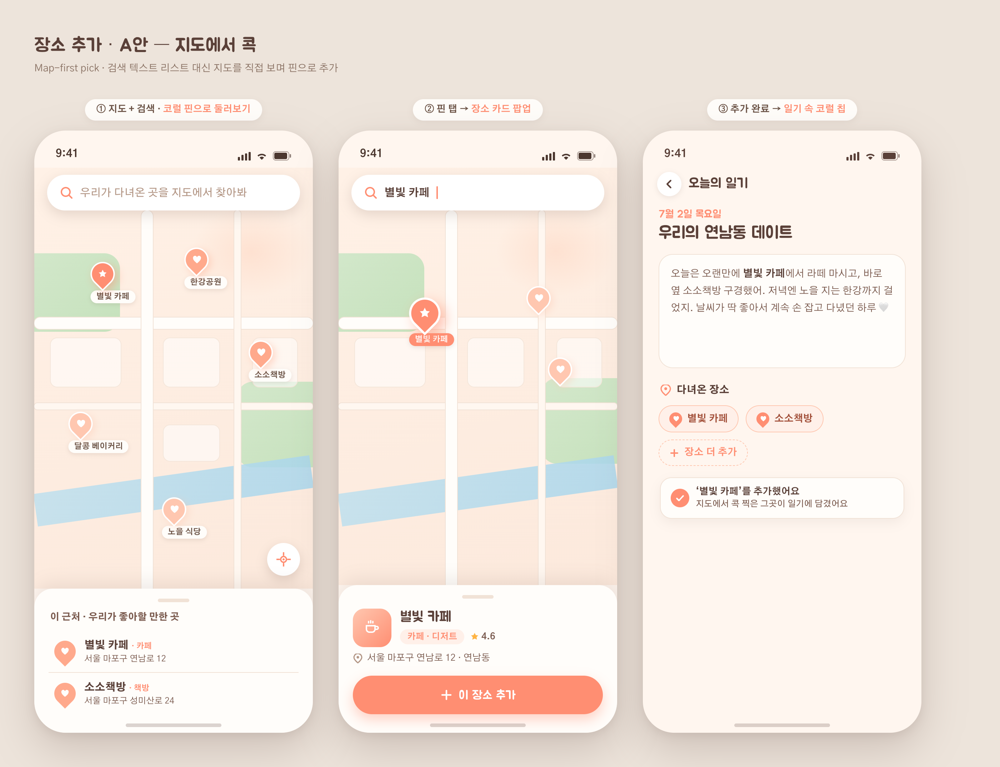
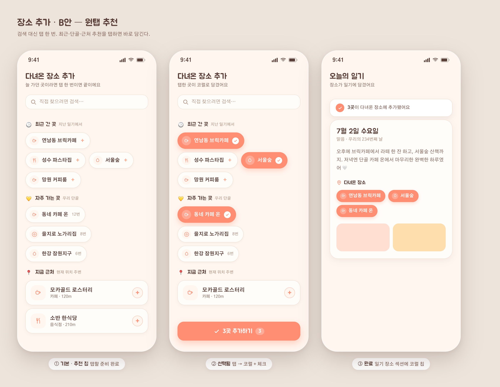
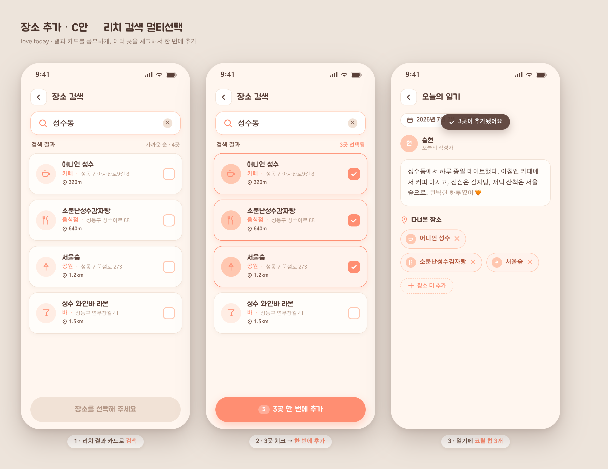

# 15 · 장소 추가 3안 목업 + 검색 시트 백그라운드 복귀 버그

**날짜**: 2026-07-05

## 1) 장소 추가 방식 3안 목업
현재 "다녀온 장소" 추가는 카카오 검색 시트(텍스트 리스트) 하나뿐이라 단조롭다. 서브에이전트 3명이 각기 다른 방향을 그렸다.

- **A안 · 지도에서 콕** — 지도 보며 핀 탭으로 추가 (위치 회상↑, WebView 상호작용 무거움)
- **B안 · 원탭 추천** — 최근·단골·근처 칩 탭 한 번 (단골 반복에 최강, 구현 가벼움)
- **C안 · 리치 검색 멀티선택** — 카드형 결과 여러 개 체크 → 한 번에 추가 (하루 여러 곳에 효율적)

**추천: B+C 하이브리드** — 기본은 추천 칩(B), 검색 누르면 카드 멀티선택(C)으로 전환. 방문횟수 집계·`placeApi` 둘 다 이미 있어 대부분 조립. 자세한 비교·이미지는 [기획 15](../planning/15-place-add.md).

| A · 지도콕 | B · 원탭추천 | C · 리치검색 |
|---|---|---|
|  |  |  |

## 2) 검색 시트 백그라운드 복귀 버그
**증상**: 장소 검색 시트를 연 채 다른 앱 갔다 오면, 검색바만 화면 위로 붙고 본문이 백지가 됨(영상 프레임에서 확인).

**원인**: 시트의 `KeyboardAvoidingView`(padding)가 복귀 시 남아있는 키보드 높이만큼 시트를 위로 밀어올려 본문을 화면 밖으로 밀어냄.

**수정**:
- `KakaoPlaceSearch.tsx`: `KeyboardAvoidingView` 제거, 검색바를 시트 상단 고정 + 목록만 스크롤. 시트 높이 90%, 목록 하단 여백 320(키보드가 목록 끝만 가리게).
- `_layout.tsx`: 앱이 백그라운드로 나갈 때 `Keyboard.dismiss()` — 복귀 시 잔여 키보드로 화면이 밀리는 걸 원천 차단.

tsc 0. 초안 자동복원(→[14](14-write-draft-restore.md))과 합쳐, 이제 다른 앱 갔다 와도 **작성 내용(기분·별점·답·장소·사진)은 유지되고 시트도 안 무너진다**.
