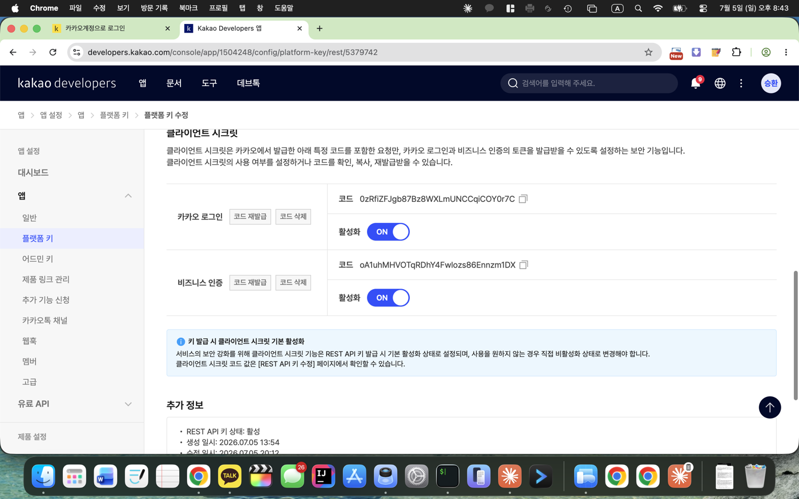

# 16 · 카카오 실로그인 완성(Client Secret) + 지도에서 장소 콕 찍어 담기(15a)

**날짜**: 2026-07-05

## 1) 카카오 실로그인 — KOE010 해결로 최종 완성

[15](15-place-add-mockups.md) 이후 카카오 로그인 백/프론트 + 콘솔 설정(로그인 활성화·Redirect URI)을 붙였는데, 실기기 테스트에서 **"카카오 로그인에 실패했어요"**가 떴다.

**증상**: 동의 화면(authorize)까지는 정상 → 앱으로 돌아올 때 실패.
**원인**: 백엔드 로그에 `KOE010 invalid_client "Bad client credentials"` (토큰 교환 401). authorize는 되는데 토큰 교환만 실패 = **Client Secret이 "사용함"인데 토큰 요청에 `client_secret`을 안 보낸** 전형적 케이스. (카카오는 REST API 키 발급 시 Client Secret을 기본 활성화한다.)

**해결**:
- `KakaoClient`: `app.kakao.client-secret`이 있으면 `/oauth/token` 폼에 `client_secret` 추가.
- 콘솔에서 값 확보 — 위치가 옮겨져 있었다: 예전 "카카오 로그인 > 보안"이 아니라 **앱 설정 > 앱 > 플랫폼 키 > REST API 키 > 클라이언트 시크릿**. 여기 시크릿이 **둘**(카카오 로그인 / 비즈니스 인증)이라, 로그인 토큰 교환엔 **"카카오 로그인" 시크릿**을 써야 한다(비즈니스 인증 것 넣으면 여전히 KOE010).
- 시크릿은 커밋하지 않고 `application-local.yml`(gitignore) + env로 주입. 재기동에도 유지.

검증: 가짜 code로 토큰 교환 시 KOE010 → **KOE320("code not found")** 로 바뀜 = 시크릿 정상 반영(실제 code면 성공). 상세 인수인계는 [매뉴얼](../manuals/kakao-login.md)에 반영.

## 2) 지도에서 장소 콕 찍어 담기 (기획 [15a](../planning/15a-place-add-mappick.md))

작성화면 "다녀온 장소"를 **지도+검색 한 시트**로 개편.

**동작 변화**
- "카카오맵에서 장소 찾기" → **"지도에서 장소 찾기"**. 누르면 상단 검색바 + 아래 전체 지도인 통합 시트.
- 열릴 때 현재위치를 지도 중심으로(권한 거부 시 서울시청 폴백), 이미 담은 곳은 핀 표시. **근처 후보 추천은 없음**(사용자 요청).
- 검색(350ms 디바운스) → 핀 갱신 + 카메라 이동. 핀 탭 → 장소 카드(이름/카테고리/거리(하버사인)/주소) → "이 장소 담기"(초록 토글).
- 지도 롱프레스 → 역지오코딩 주소 + 이름 입력 → "이 이름으로 담기"(**좌표까지 저장**).
- 검색 0건 시 두 옵션: **"이름만 등록"** / **"이름 + 지도에서 위치 직접 선택"**.
- "담은 장소 N" 바스켓 → "N곳 일기에 넣기" 확정(하루 여러 곳 이어담기).

**스키마(좌표 저장 + 하위호환)**: 이름은 여전히 `locations: string[]`가 소스(기존 저장/조회/추천/카운트 무변경). 좌표는 name으로 매칭되는 별도 컬렉션 `locationPoints(name/lat/lng/category)`로만 추가 → 직접 찍은 핀도 지도 탭에서 정확히 재현. `PlaceService` 프록시가 카카오 로컬 x/y를 통과. `expo-location` 추가.

**백엔드 QA (실제 카카오 API + DB 왕복, 모두 통과)**
- `/api/places?query=성수 대림창고` → 결과에 `lat/lng/category` 실려옴 ✅
- 좌표 엔트리 저장→조회: `locationPoints` 좌표·카테고리 정확히 유지(수동핀은 category 없이) ✅
- 하위호환: 이름만 저장한 엔트리 → `locations` 유지, `locationPoints` 빈 배열, 크래시 없음 ✅
- 프론트 `tsc` 0 에러, 백엔드 컴파일 성공.

**실기기 확인 필요(장치 의존)**: 카카오 로그인 끝단(실제 code 왕복), 지도 렌더·롱프레스 좌표 정확도·위치 권한 흐름.
