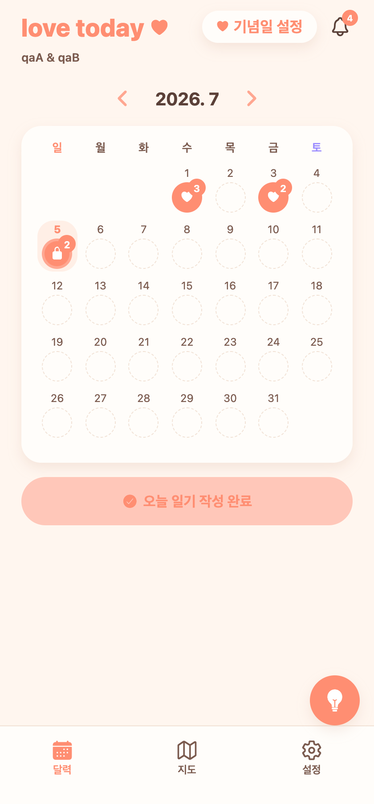
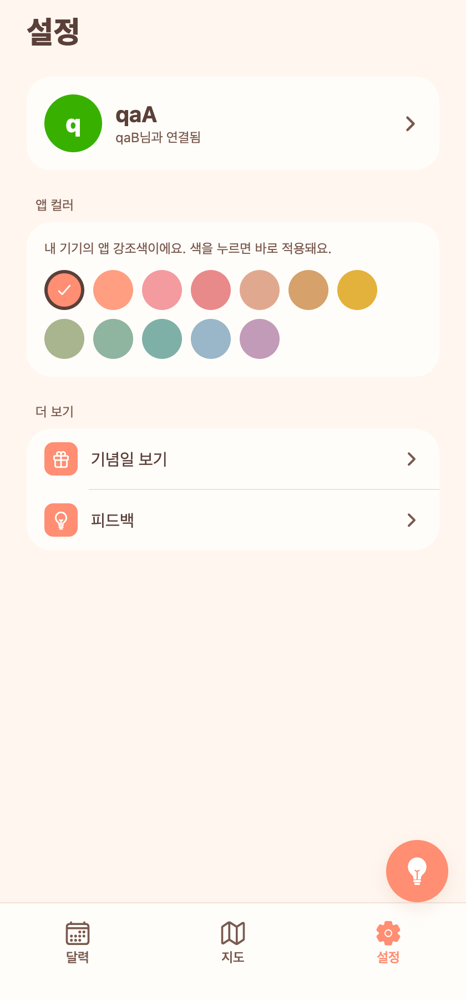
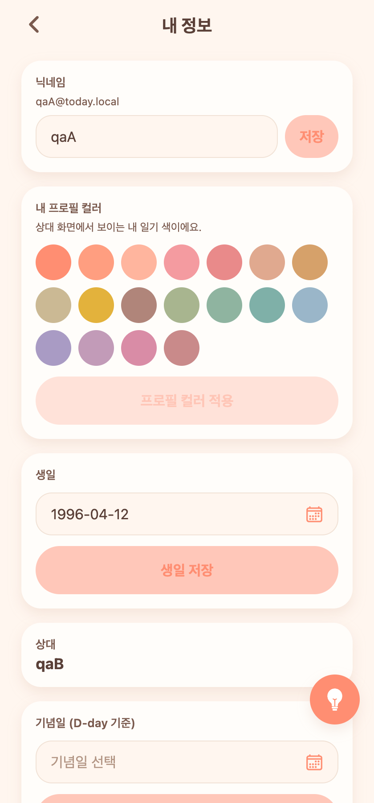
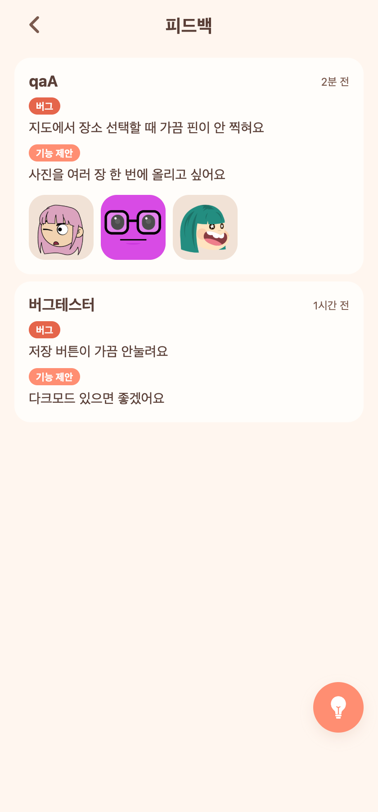
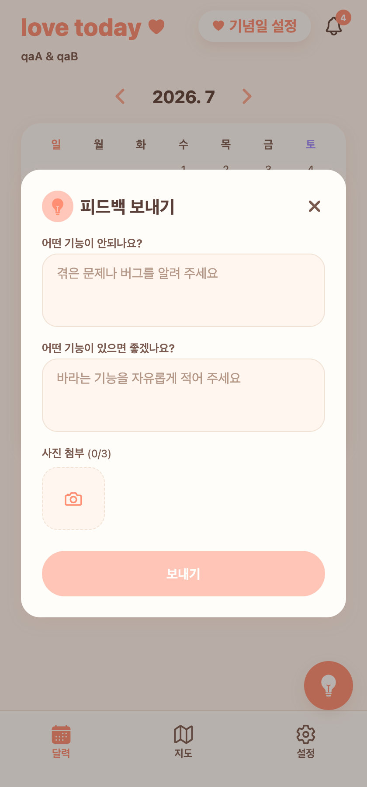
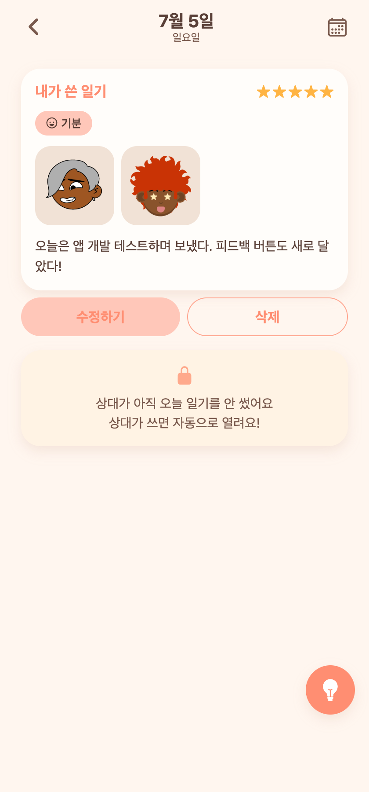

# 17 — 피드백 이미지 첨부 · FAB 고정 · 저장 토스트 · 설정 애플 스타일 개편

날짜: 2026-07-05
계정: dev `qaA`(couple 11, qaB와 연결) / 백엔드 8083 · 웹 today-web 터널
캡처: Playwright + Expo Web headless(폰 뷰 420×900, 앱만) — 방식은 `docs/manuals` 및 muscle-game `docs/manual/SCREENSHOT_CAPTURE.md` 참조

---

## 이번 작업(요청 배치)

1. **피드백 모달 이미지 첨부(최대 3장)** — 갤러리에서 골라 업로드, 썸네일·삭제, 서버 저장/노출
2. **피드백 FAB 위치 고정** — 드래그 이동 제거, 우측 하단 고정. 아이콘/문구를 "피드백"으로 통일(전구)
3. **이미지 저장 완료 토스트** — 저장 성공 시 알림창 대신 하단에 잠깐 뜨는 토스트("이미지 저장이 완료되었습니다.")
4. **전체화면 이미지 아래로 스와이프 닫기 안정화** — 세로 제스처를 캡처 단계에서 가로 FlatList보다 먼저 가로채도록 수정
5. **홈 버튼 상태화** — 오늘 일기를 이미 썼으면 "오늘 일기 쓰기" 대신 "오늘 일기 작성 완료"(탭 시 상세 보기)
6. **설정 애플 스타일 개편 + 내 정보 그룹** — 설정을 그룹형 리스트로. 닉네임·프로필컬러·생일·상대·기념일·로그아웃을 "내 정보"(account) 하위 화면으로 이동. 앱 컬러 등 간단한 건 설정에서 바로

---

## 화면 캡처

| 홈 — 오늘 일기 작성 완료 | 설정 — 애플 스타일 그룹 | 내 정보(account) |
|---|---|---|
|  |  |  |

| 피드백 목록 — 첨부 이미지 | 피드백 모달 — 사진 첨부(0/3) | 오늘 일기 상세(사진) |
|---|---|---|
|  |  |  |

---

## 구현 메모

### 백엔드 (`com.today.report`)
- `BugReport.imageUrls` `@ElementCollection`(`bug_report_images` 테이블, url ≤ 500). `ddl-auto: update`로 재기동 시 자동 생성 확인.
- `CreateBugReportRequest`/`BugReportResponse`에 `imageUrls` 추가. 서비스에서 빈 값 제거 후 **최대 3장** 저장.
- 기존 데이터 하위호환: 이미지 없던 리포트는 `imageUrls: []`로 응답.

### 프론트
- `BugReportFab.tsx`: `PanResponder`/`Animated` 드래그 제거 → `useSafeAreaInsets` 기반 우측 하단 고정. 모달에 `expo-image-picker` + `uploadPhoto`로 이미지 첨부(썸네일·× 삭제), 아이콘 `bulb`.
- `bug-reports.tsx`: 첨부 썸네일 행 + 탭 시 전체보기 모달, 헤더/빈상태 "피드백" · `bulb-outline`.
- `AppToast`(신규): 전역 토스트 스토어(`useToastStore`) + `_layout` 마운트, `showToast()` 헬퍼. 사진 저장 성공에 적용.
- `entry/[date].tsx`: `onMoveShouldSetPanResponderCapture`로 세로 우세 제스처 선점 → 아래로 스와이프 닫기 안정화.
- `index.tsx`: `todayEntry?.mineWritten`이면 "오늘 일기 작성 완료"(soft·체크아이콘, 탭→상세).
- `settings.tsx`: 프로필 헤더(→`account`) + 앱 컬러(탭 즉시 적용) + "더 보기"(기념일 보기·피드백) 그룹 리스트로 재작성.
- `account.tsx`(신규): 기존 설정의 닉네임/프로필컬러/생일/상대/기념일/로그아웃을 이관.

### 검증
- 백엔드: dev-login → `POST /api/bug-reports`(imageUrls 3장) → `GET`으로 라운드트립 확인, 하위호환 확인. 새 테이블 생성 확인.
- 프론트: `tsc --noEmit` 클린. Playwright 캡처로 6개 화면 실제 렌더 확인(애니풍 DiceBear 더미 이미지 사용).
