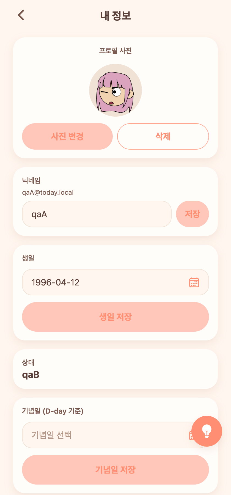
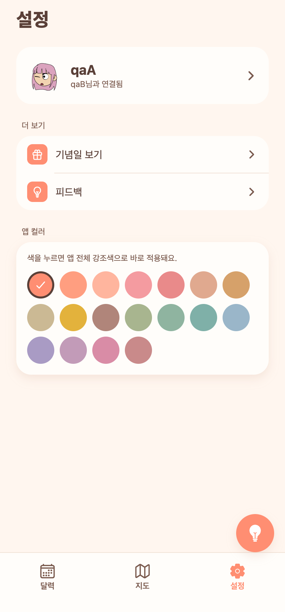

# 18 — 프로필 사진 · 색상 앱컬러 통일 · 저장 토스트/스와이프 수정

날짜: 2026-07-05
계정: dev `qaA`(couple 11, qaB 연결) / 백엔드 8083 · 웹 today-web 터널
캡처: Playwright + Expo Web headless(폰 뷰 420×900, 앱만)
진행: **병렬 서브에이전트 2개**(백엔드 / 프론트)로 프로필 사진 기능 동시 구현

---

## 이번 작업

1. **프로필 사진 추가/변경/삭제** — 내 정보 화면에서 갤러리 사진 업로드로 프로필 사진 설정·교체·삭제. 설정 헤더 아바타에도 반영.
2. **색상 앱컬러 통일** — 일기의 "내 색상/상대 색상"(코럴 vs 보라) 구분을 없애고 전부 앱 컬러로. 설정 색 선택도 **앱 컬러 하나**로 단순화(프로필 컬러 제거).
3. **저장 완료 토스트 수정** — 풀스크린 이미지 뷰어(Modal)에 가려 안 보이던 토스트를 뷰어 안에서 직접 표시.
4. **아래로 스와이프 닫기 안정화** — 가로 넘김(FlatList)과 충돌하던 세로 제스처를 캡처 단계에서 선점.

---

## 화면 캡처

| 내 정보 — 프로필 사진(추가/변경/삭제) | 설정 헤더 — 사진 반영 + 앱 컬러 단일 |
|---|---|
|  |  |

---

## 구현 메모

### 프로필 사진 (병렬 에이전트)
- **백엔드**: `User.profileImageUrl`(컬럼 `profile_image_url`) + `UserSummary`/`PartnerSummary`/`UpdateMeRequest`에 반영. `updateMe` 규칙 — **생략=변경 없음 / 빈 문자열=삭제(null) / 값=설정**. `ddl-auto: update`로 컬럼 자동 추가.
- **프론트**: `account.tsx`에 "프로필 사진" 카드(96px 원형, 없으면 앱컬러+이니셜). "사진 추가/변경"=`expo-image-picker`→`uploadPhoto`→`PATCH /api/me`, "삭제"=확인 후 `profileImageUrl:''`. `settings.tsx` 헤더 아바타도 사진 우선 표시. `api.ts` 타입 반영.
- **검증(e2e)**: dev-login → `PATCH {profileImageUrl:"..."}` 설정 확인 → 닉네임만 수정해도 사진 유지(생략=무변경) → `{profileImageUrl:""}`로 null 삭제 확인. 3가지 시맨틱 모두 통과.

### 색상 통일
- `entry/[date].tsx`: SideCard accent를 내/상대 구분 없이 `c.primary`로, 기분 pill도 coral 고정.
- `CalendarGrid`/`DatePickerSheet`: 토요일 라벨의 보라(`colors.partner`) 제거 → 주말 라벨 앱 컬러로 통일.
- `settings.tsx`: 프로필 컬러/앱 컬러 이중 구조 → **앱 컬러 단일 선택**(탭 즉시 적용). `avatarColor` 표시 의존 제거.

### 토스트·스와이프
- 전역 `AppToast`는 풀스크린 `Modal` 뒤로 가려짐 → `PhotoViewer` 내부에 로컬 토스트(Animated) 추가해 뷰어 위에서 "이미지 저장이 완료되었습니다." 1.5초 표시.
- `onMoveShouldSetPanResponderCapture`로 세로 우세 제스처를 가로 FlatList보다 먼저 잡아 아래로 스와이프 닫기 안정화.
