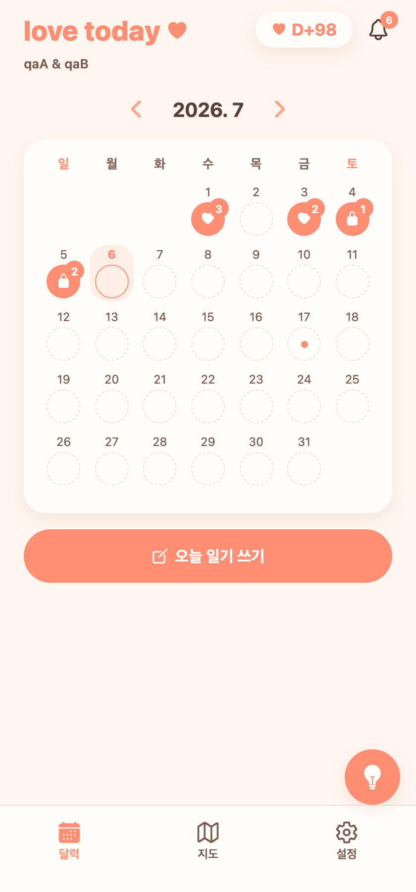
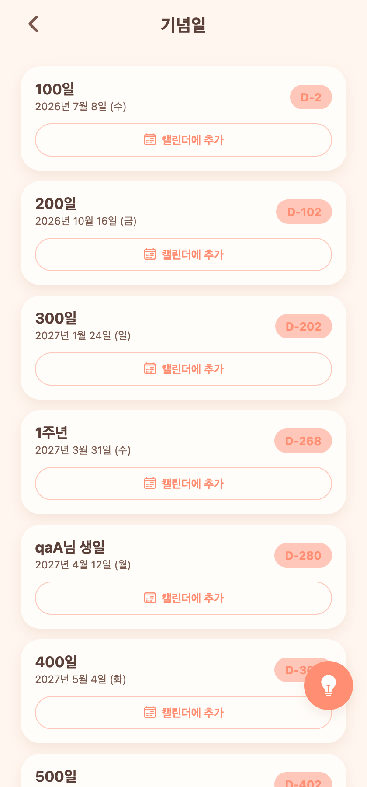
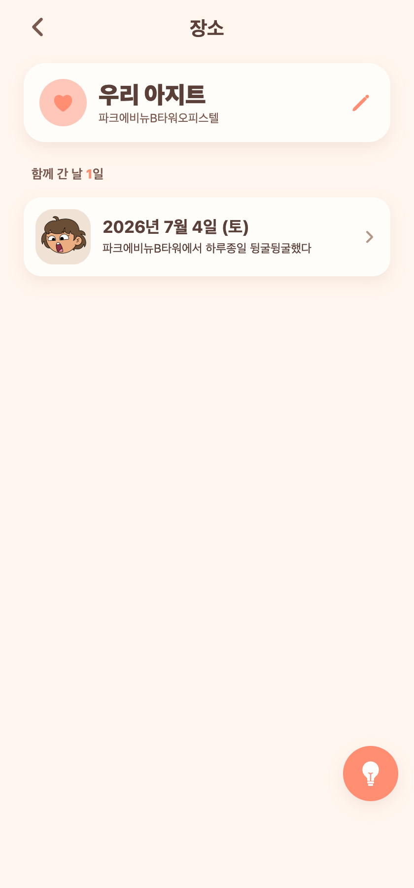

# 19 — 장소 상세(별명·일기 모음) · 기념일 캘린더 표시 · 색상 통일

날짜: 2026-07-06
계정: dev `qaA`(couple 11) / 백엔드 8083 · 웹 today-web 터널
진행: 백엔드 CRUD는 병렬 서브에이전트, 프론트는 메인에서 동시 진행

---

## 이번 작업

1. **지도 장소 상세 화면** — 지도 탭에서 장소 카드 탭 → 전용 상세(`/place`). 별명(크게)+장소명(작게), 별명 편집, 그곳에 갔던 날 일기를 **날짜별 카드**(대표사진+한줄, 탭→그날 일기)로 모아보기.
2. **지도 하단 팝업 개선** — X 버튼 + 지도 빈 곳 탭으로 닫기, 지도 세로 살짝 축소(하단 여백), 카드에 별명 우선 표시.
3. **기념일 → 캘린더 표시** — 기념일 목록에서 '캘린더에 추가' 토글 → 홈 캘린더에 **작은 점**. 그날 일기를 쓰면 점은 사라지고 하트만 남음(일기 없는 날만 점).
4. **색상 통일** — 기념일 D-day 배지, 획득 스티커 하트, 상대 댓글 말풍선을 앱 컬러 파생값으로(정적 코럴/보라 → 앱 색 따라가게).

각 UI 방향은 AskUserQuestion으로 사용자가 결정: 상세=전용 화면, 별명=크게+장소명 작게, 일기=날짜별 카드, 팝업 닫기=X+빈 곳 탭, 캘린더=내가 고른 것만 추가, 표시=작은 점.

---

## 화면 캡처

| 홈 캘린더 — 콕 찍은 날 작은 점(7/17) | 기념일 — 캘린더에 추가 토글 | 장소 상세 — 별명+일기 모음 |
|---|---|---|
|  |  |  |

---

## 구현 메모

### 백엔드 (병렬 에이전트 2건)
- **PlaceNickname**(place_nicknames, couple+name unique) + `PUT /api/locations/nickname`(빈값=삭제) + `GET /api/locations/detail?name=`(별명+날짜별 일기: 대표사진·한줄·mine/partnerWritten, 일자 dedup·최신순) + `GET /api/locations`에 `nicknames` 추가. (JPQL `DISTINCT`+`ORDER BY` MySQL 오류 → distinct 제거로 수정.)
- **CalendarMark**(calendar_marks, couple+date unique) + `GET/POST/DELETE /api/calendar-marks`.

### 프론트
- `app/place.tsx`(신규): 별명 인라인 편집 + 날짜별 일기 카드.
- `KakaoMap.tsx`: 지도 빈 곳 탭 → `deselect`(마커 탭은 억제 플래그로 구분).
- `map.tsx`: 카드 탭→상세, X/빈곳 닫기, 별명 표시, 지도 높이 축소.
- `CalendarGrid.tsx`: `markedDates` prop → 일기 없는 날에만 작은 점.
- `index.tsx`: 마크 로드 후 캘린더에 전달.
- `anniversaries.tsx`: 낙관적 토글로 캘린더 추가/제거.

### 검증
- 백엔드 e2e: nickname set/detail(entries 채워짐)·calendar-marks add/list/delete 모두 확인.
- 프론트 tsc 클린. Playwright 캡처 3종으로 실제 렌더 확인.
