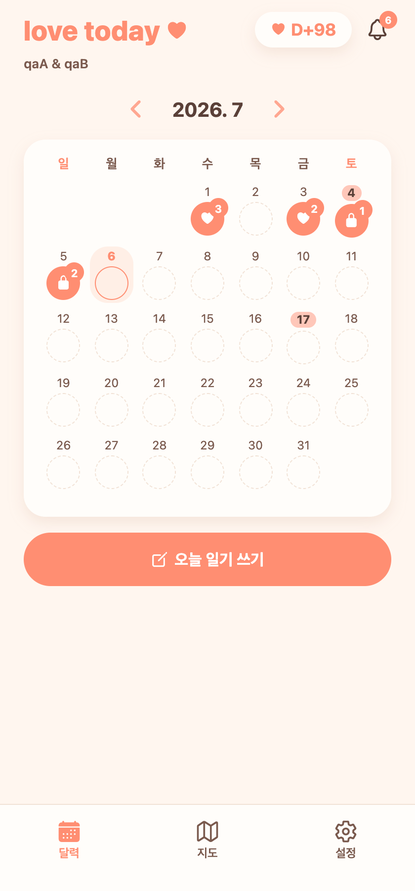
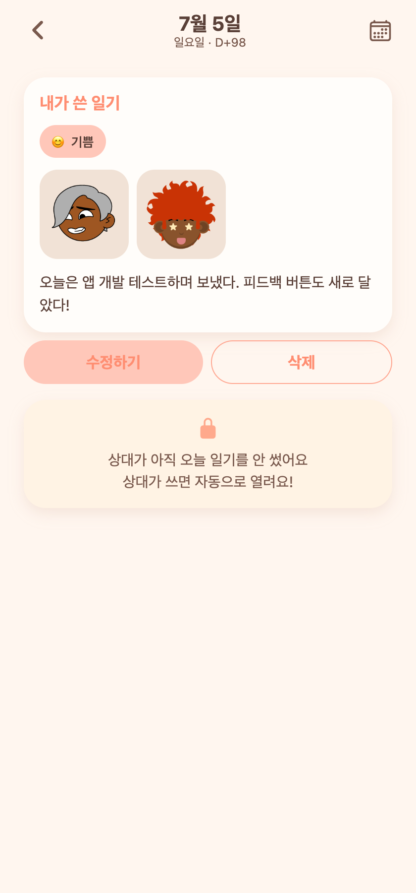

# 20 — 기분 이모지·별점 제거·이미지 로딩 개선·리포트 제거·캘린더 4안

날짜: 2026-07-06
계정: dev `qaA`(couple 11) / 백엔드 8083 · 웹 today-web 터널
진행: 백엔드 CRUD·썸네일은 병렬 서브에이전트, 프론트는 메인에서 동시 진행. UI 방향은 AskUserQuestion으로 사용자가 결정.

---

## 이번 배치

1. **오늘의 기분 → 이모지+라벨** — 의미가 안 드러나던 벡터 아이콘(잎·원·달)을 이모지로: 😊기쁨 🥰사랑 😌평온 😐그냥 😢슬픔 😴피곤. 상세 화면 기분 태그도 이모지+라벨.
2. **데이트 별점 제거** — '오늘 데이트 점수'(별점)와 필수검증·상세 별 표시 삭제(이제 기분만 필수). 별점 대신 무엇을 넣을지 물었고 "그냥 제거" 선택.
3. **이미지 로딩 개선(세 가지 모두)** — expo-image 캐시 + 업로드 리사이즈 + 백엔드 온디맨드 썸네일.
4. **기념일 캘린더 표시 4안** — '작은 점(일기 없을 때만)'에서 '날짜 배경 하이라이트'로. 일기를 써서 하트가 생겨도 기념일 표시가 유지됨(목업 5안 비교 후 4안 선택).
5. **리포트(피드백) 버튼·기능 제거** — 우측 하단 전구 FAB·버그리포트 화면·설정 메뉴·API·백엔드 report 패키지 삭제.
6. **지도 장소 카드** — 문구 'N개의 추억이 있는 곳이에요.'로, '탭해서 자세히' 제거, 카드 전체 탭+눌림 효과로 상세 이동, 닫기 X 분리.

**그 외 같은 세션 반영분**: 지도 라벨 탭→근처 후보 목록(오피스텔/타워는 category_group_code가 없어 탭 지점 **주소 키워드 검색**으로 포함), 탭 핀을 좌표 중앙에 정렬, 획득 스티커 하트·상대 댓글·기념일 D-day 배지도 앱 컬러 파생값으로 통일.

---

## 화면 캡처

| 홈 캘린더 — 기념일 4안(4일=일기+하이라이트, 17일=기념일만) | 상세 — 별점 없음 + 😊기쁨 이모지 태그 |
|---|---|
|  |  |

---

## 구현 메모

### 기분 이모지
- `constants/content.ts`: `MOODS`를 `{key, emoji, label}`로, `moodEmoji`/`moodLabel` 헬퍼(기존 `moodIcon` 대체). write 피커·entry pill을 이모지 렌더로.

### 별점 제거
- `write/[date].tsx`: 별점 Card·필수검증·payload·상태 제거. `writeDraft.ts`에서 `rating` 필드 제거. `entry/[date].tsx`: SideCard 별 표시 제거.

### 이미지 로딩
- **expo-image**로 교체(`PhotoThumb`, 상세 그리드, 풀스크린 뷰어, 장소 상세 썸네일) — `cachePolicy="memory-disk"` + `transition`. 재방문 즉시.
- **백엔드 썸네일**(서브에이전트): `GET /api/photos/thumb?path=&w=`(thumbnailator, 디스크 캐시, path-traversal 가드, permitAll). 실측 원본 188KB → 200px **2.7KB**.
- **업로드 리사이즈**: `expo-image-manipulator`로 최대 1440px + compress 0.7(네이티브, 업스케일 방지). `lib/images.toThumb`/`toFull` 헬퍼(우리 /files/만 썸네일, 외부 http는 원본).

### 캘린더 4안
- `CalendarGrid`: `markedDates`가 있으면 일기 유무와 무관하게 날짜 숫자에 코럴 배경 하이라이트(기존 '일기 없을 때만 점' 조건 제거).

### 리포트 제거 / 지도 카드
- FAB·화면·라우트·`bugReportApi`·백엔드 `report` 패키지 삭제(DB 테이블은 잔존, 미사용).
- `map.tsx`: 카드 Pressable + `pressed` 눌림 효과(scale 0.98+opacity), X는 카드 내 오버레이.

### 검증
- 프론트 tsc·백엔드 컴파일 클린. 썸네일 e2e(업로드→thumb 로컬·터널 2.7KB), 캘린더 마크·기분·별점 제거 실제 화면 확인.
