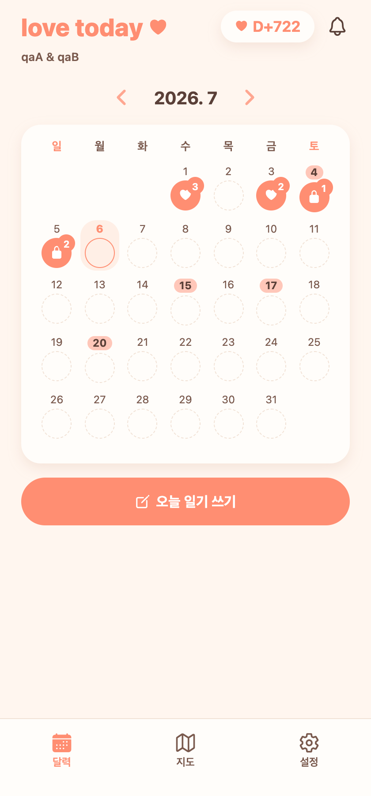
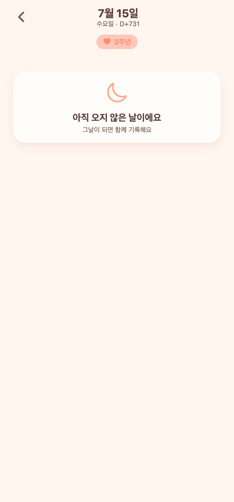
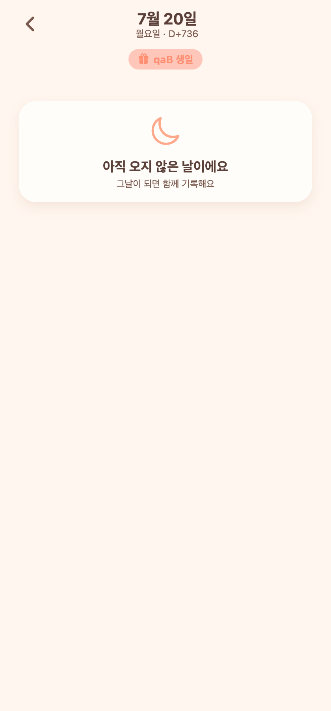

# 21. 기념일·생일 매년 반복 표시 + 일기 상단 기념일 배지

## 요청
1. 기념일·생일도 **매해** 보여지도록.
2. 기념일(캘린더에 있는 날)에 일기장을 들어가면 **화면 상단에 "기념일"** 이라고 표시.

## 한 일

### 1) 기념일·생일 매년 반복
- 커플 기념일(사귄 날)과 두 사람의 생일은 해가 바뀌어도 같은 월/일에 다시 온다 → 보고 있는 달에 해당하면 **항상 캘린더에 하이라이트**.
- 연도와 무관하게 계산하는 공용 유틸 `lib/anniversary.ts` 신설:
  - `specialDayFor(날짜, {기념일, 내생일, 상대생일, 이름들})` → 그 날짜가 특별하면 라벨 반환.
  - 기념일은 만난 해 이후 자동으로 **N주년**(1주년·2주년…)으로 계산.
  - 2/29 생일은 평년엔 2/28에 표시되도록 보정.
- 홈 캘린더가 매달 이 유틸로 특별한 날을 계산해 기존 "콕 찍은 날"과 합쳐 표시.

### 2) 일기 상세 상단 배지
- 그 날짜가 기념일/생일이면 헤더 바로 아래에 배지 표시:
  - 기념일 → ❤️ `N주년`
  - 생일 → 🎁 `○○ 생일`
- 평범한 날엔 배지 없음.

### 3) 상대 생일 노출(백엔드)
- 캘린더/배지에서 상대 생일도 매년 표시하려면 상대 생일 정보가 필요 → 파트너 요약 응답(`PartnerSummary`)에 `birthday` 추가.

## 검증 (Expo Web + Playwright)
- 2026.7 캘린더: 15일(2주년)·20일(qaB 생일) 하이라이트 ✔
- 일기 상세 7/15 → "❤️ 2주년", 7/20 → "🎁 qaB 생일", 7/10(평범) → 배지 없음 ✔
- 매년 반복: 2025→1주년, 2027→3주년, 2028→4주년, 생일도 매년 ✔

