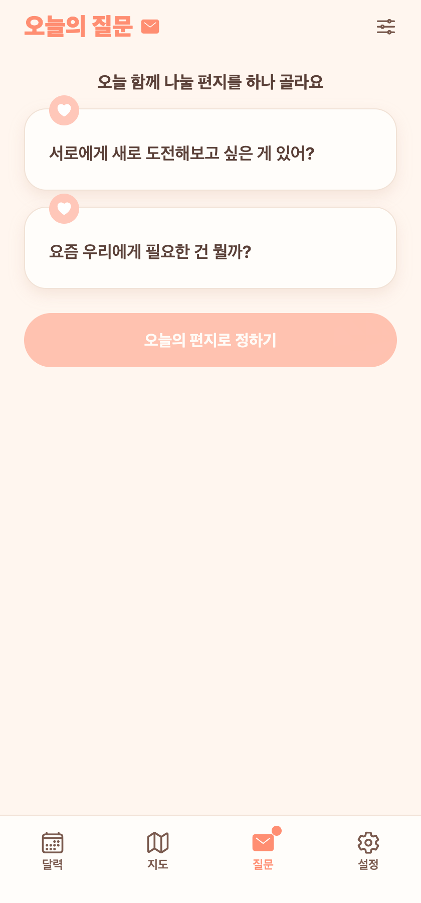
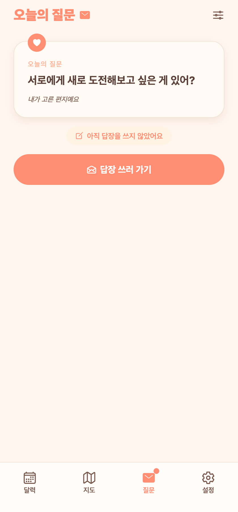
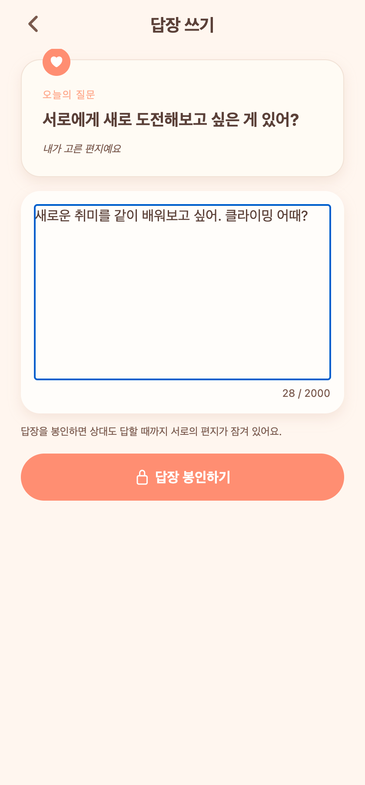
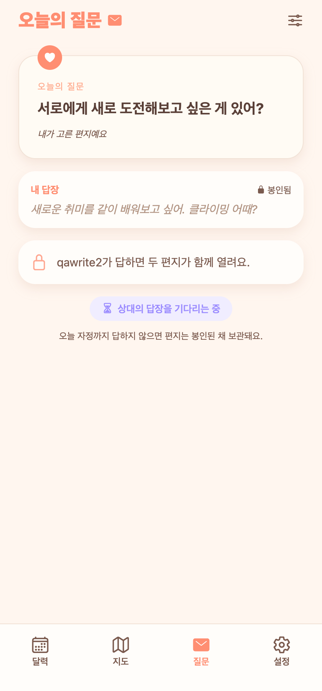
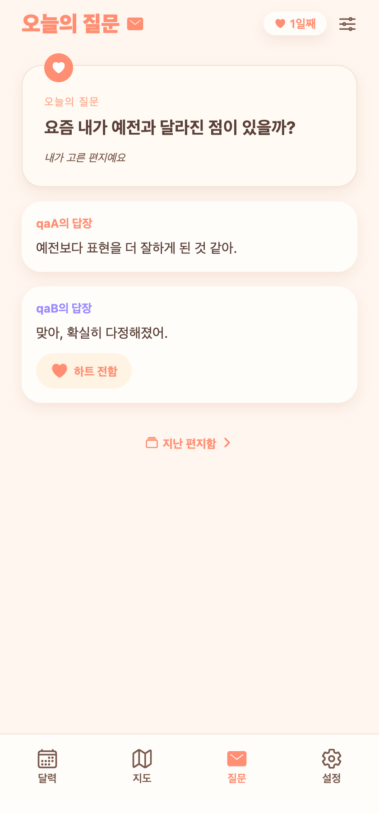
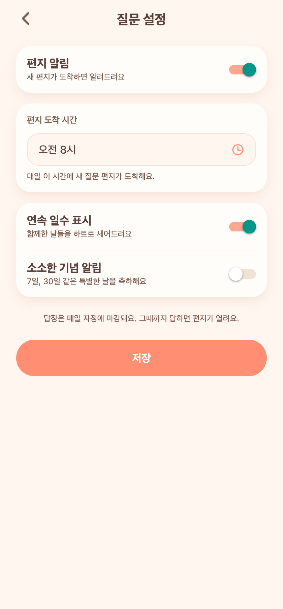

# 22. 오늘의 질문(감성 편지함) 구현 — 분리형 V1

## 요청
확정안(분리형 V1)대로 '오늘의 질문' 기능 전체 구현 → 코드 품질·UX 고려 → 타이트 QA → 버그 수정 후 푸시 → devlog.

## 무엇을 만들었나
매일 질문 **2개**가 도착하고, **먼저 본 사람이 하나를 고르면**(안 고른 건 그날 사라짐) 그 질문이 '오늘의 편지'가 된다. **선택과 답장은 분리** — 두 사람이 각자 답을 쓰고 봉인한다. **둘 다 봉인하면** 서로의 편지가 열리고, 답은 '지난 편지함'에 쌓인다. 그날 **자정 마감**, 못 하면 스트릭이 끊긴다.

### 탭바
달력·지도·설정(3) → **달력·지도·질문·설정(4)**. '질문' 탭(✉)에 할 일이 있으면 코럴 점 뱃지.

### 백엔드 (`com.today.question`)
- 엔티티5(질문풀·일일배정·답장·반응·설정)/리포5/서비스/컨트롤러(`/api/questions/daily`)/DTO/시드 30문항.
- KST 기준, 도착시간 이후 lazy 배정(2개), 상태머신(BEFORE_ARRIVAL·NEEDS_CHOICE·NEEDS_ANSWER·WAITING_PARTNER·OPENED), 스트릭·milestone(100번째) 계산.
- 가드: 빈 답장 400, **본인 답장엔 하트 불가 403**, 중복 답장 차단, 잘못된 questionId 400.

### 프론트
- `질문` 탭: 상태별 6분기 화면(미연결·도착 전·봉투 선택·답장 필요·상대 대기·열림), 은은한 스트릭 헤더, 편지 감성.
- 답장 쓰기 / 지난 편지함 / 지난 편지 상세 / 설정(알림·도착시간·스트릭·기념) 화면.
- `useQuestionStore`(낙관적 하트 토글), `dailyQuestionApi`.

## QA (Expo Web + Playwright, 실제 계정 E2E)
- 선택 → choose → 답장 필요 → 답장 쓰기·봉인 → 대기 → (상대 봉인) → 열림 전 과정 통과.
- 백엔드 가드(빈값 400·본인답 403·중복답장 차단·하트 토글·아카이브·스트릭) 통과.

### 발견·수정한 버그
- **상대 답장 라벨/문구가 `chosenBy`(질문 고른 사람) 기준**이라, 내가 질문을 고른 날엔 상대 답장이 내 닉네임("qaA")으로 잘못 표시됨 → 실제 상대 닉네임(`authStore.partner`)으로 정정(열림·대기 화면 3곳). 재검증 완료(아래 열림 캡처: "qaA의 답장" / "qaB의 답장").

## 화면
| 봉투 선택(+탭 뱃지) | 답장 필요 | 답장 쓰기 |
|---|---|---|
|  |  |  |

| 상대 대기 | 편지 열림(닉네임 수정) | 설정 |
|---|---|---|
|  |  |  |

## 남은 것(후속)
- **AI 질문 생성 파이프라인**으로 `question_pool` 확장(현재 시드 30문항). 화면·스키마는 확정돼 내용 공급만 교체하면 됨.
- 파트너 알림(choose/answer 시) — 현재 TODO 주석. 도착 시간 푸시·자정 마감 배치.
- 상세 명세: `docs/planning/24-daily-question-v1-spec.md`.
