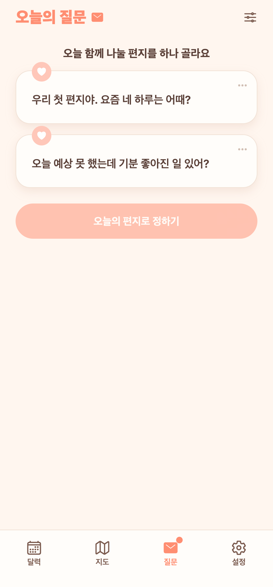

# 23. 오늘의 질문 — AI 질문 세트 구현

## 요청
문서 25 설계(톤 1:3:1 / 테마 분류 / 리듬 배합 / 가벼운 맥락 / 주기 배치 보강)대로 구현. 서브에이전트 활용, 타이트 QA 후 버그 수정·푸시·devlog.

## 무엇을 만들었나
"어떤 질문이, 어떻게 나오는가"를 실제로 구현. 매일 오는 2개가 **요일 리듬 + 톤 비율 + 커플의 객관적 맥락(기념일·생일 등)** 으로 골라진다. 일기 본문·기분은 일절 사용하지 않는다.

### 질문 풀 (태깅 198개)
- `question-seed.json` 198개: 일반 180 + 맥락 템플릿 18. 각 질문에 theme·tone(deep/light/fun)·depth·contextTrigger 태깅.
- light 기준 상향 반영("점심 뭐 먹었어?" 류 배제, 취향·감정·관점이 드러나는 한 줄).
- 시드 로더가 text 기준 upsert(태그 갱신), 빠진 옛 시드는 자동 비활성(FK 보존).

### 배정 알고리즘
- **요일 리듬**: 평일 가벼움, 주말 깊음. 전역 톤 비율 1:3:1로 보정.
- **맥락 트리거**(우선순위 기념일·생일 > streak > 계절): 활성 시 한 통을 맥락 템플릿으로.
- 최근 45일 받은 질문 회피, **2개는 톤·테마가 서로 다르게**.

### 맥락 템플릿
- placeholder 치환: `{N}`(일수/주년수), `{상대}`(상대 닉네임).
- 기념일 N주년/N일·생일·연속 마일스톤·첫 편지·오랜만 복귀.

### 신고 & 자동 비활성
- 선택 화면 봉투에 은은한 '⋯' → "이 질문 덜 보여드릴까요?" → `POST /report`.
- 서로 다른 커플 3팀 이상 신고하면 자동 `active=false`.

### 관리자 배치 생성(구조까지)
- `POST /api/admin/questions/generate`(관리자 토큰). 자동 필터(중복·길이·물음표·금칙어·유효성)는 실구현, LLM 생성기는 disabled 스텁 — 키만 넣으면 연결되게 분리.

## QA (실제 계정 E2E)
- 배정: 2개 질문 tone·theme **서로 다름** 확인.
- 맥락 렌더: 생일 "○○야, 이번 생일에 제일 받고 싶은 하루는?" / 1주년 "1주년인 지금, 서로한테 제일 고마운 건?" / 첫 편지 "우리 첫 편지야…" 확인.
- 신고: 204·같은 커플 멱등, 3커플 신고 → 자동 비활성 로직 확인.

### 발견·수정한 버그
- **1주년 임박인데 "1일이라니…"로 렌더**됨(주년 N=1을 '일' 템플릿에 잘못 대입). 원인: 기념일 트리거가 주년/일을 구분 안 함 + 시드에 '주년' 템플릿 부재.
- 수정: 컨텍스트 신호에 단위(year/day) 추가 → 단위에 맞는 템플릿만 선택, '주년' 템플릿 2개 시드 보강. 재검증에서 "1주년인 지금…"으로 정상.

## 화면

**선택 화면 — 봉투 우상단 은은한 '⋯' 신고 (탭 뱃지 포함)**

## 남은 것(후속)
- 외부 LLM 실연동(관리자 생성기 구현 + 키/비용) — 지금은 구조만.
- 도착시간 푸시·자정 마감 배치·파트너 알림.
- 설계 문서: `docs/planning/25-daily-question-ai-plan.md`.
