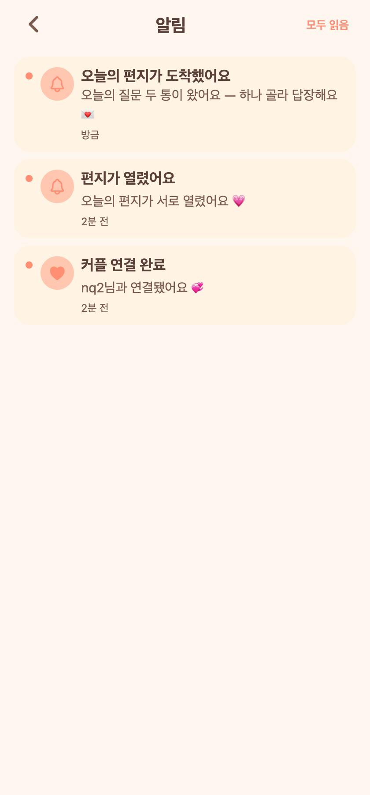

# 24. 오늘의 질문 — 알림 & 스케줄러 (외부 LLM 제외)

## 요청
후속 작업 중 **외부 LLM 연동을 제외**한 나머지: 파트너 알림 / 도착시간 알림 / 자정 마감.

## 무엇을 만들었나
모두 **인앱 알림**(기존 벨/알림 목록 재사용, Expo Go라 원격 푸시는 EAS 빌드 후속). 새 화면 없이 기존 알림 화면에 자연스럽게 쌓인다.

### 파트너 알림 (상대 행동 → 나에게)
- 상대가 오늘 질문을 **골랐을 때** → "오늘의 질문이 정해졌어요"
- 상대가 **답장했는데 내 차례**일 때 → "상대가 답장했어요 — 나도 쓰면 열려요"
- **둘 다 답해 열렸을 때** → 양쪽에게 "편지가 열렸어요"
- 같은 날짜·타입 중복은 생성 안 함.

### 스케줄러 (`@EnableScheduling`, KST cron)
- **도착시간**: 10분마다 각 커플의 설정 도착시간이 지났는지 확인 → 아직 배정 전이면 배정 + "오늘의 편지가 도착했어요" 알림(알림 on인 커플만).
- **자정 마감**: 매일 00:05(KST) → 어제 골랐지만 열리지 못한 편지가 있으면 "편지가 지나갔어요" 알림.

## QA (실제 계정 E2E)
- 선택 → 상대 `QUESTION_CHOSEN` ✔
- 답장 → 상대 `QUESTION_ANSWERED` ✔
- 둘 다 답장 → `QUESTION_OPENED`(양쪽) ✔
- **도착 스케줄러**: 실제 10분 cron 틱(18:20 KST)이 발동해 `QUESTION_ARRIVED` 생성 확인 ✔ (@Scheduled KST 배선 검증)
- 자정 마감: 도착과 동일한 스케줄 배선·로직으로 구현(00:05 cron).

## 화면

**알림 목록 — 오늘의 질문 알림이 기존 벨 UI에 표시**

## 남은 것
- 외부 LLM 실연동(관리자 생성기 + 키) — 요청대로 제외, 후속.
- 진짜 폰 푸시는 EAS 빌드 후속(현재 인앱 알림).
