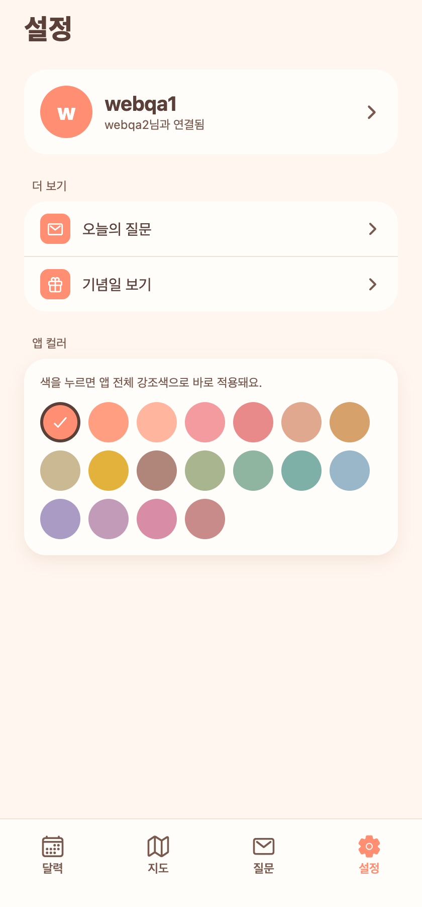
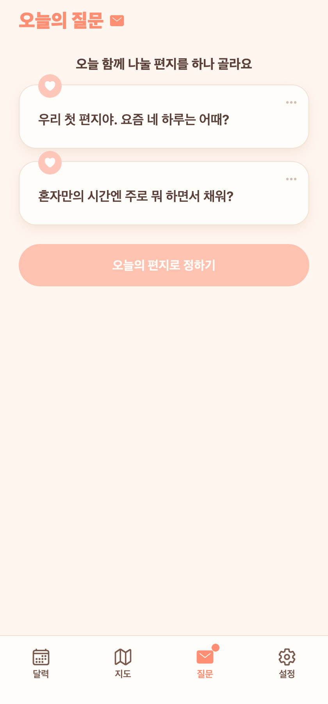

# 26. 오늘의 질문 설정을 설정 탭으로 합치기

## 요청
질문 탭 우측 상단의 설정 아이콘(질문 알림·도착시간·스트릭 등)을 기존 **설정 탭**에 합쳐줘.

## 무엇을 바꿨나
- **질문 탭 헤더의 우측 상단 설정 아이콘 제거** — 헤더는 이제 "오늘의 질문 ✉" 제목 + 스트릭만.
- **설정 탭 '더 보기'에 "오늘의 질문" 행 추가** — 탭하면 기존 질문 설정 화면(`/question/settings`: 알림·도착시간·스트릭·기념)으로 이동. '기념일 보기' 위에 배치.
- 두 행 사이 얇은 구분선 추가로 정리.

설정 화면 자체(`app/question/settings.tsx`)는 그대로 재사용 — 진입점만 설정 탭으로 옮긴 것.

## 화면

**설정 탭 — '더 보기'에 오늘의 질문 추가**

**질문 탭 — 우측 상단 아이콘 제거**

## QA
- Expo Web: 설정 탭에 '오늘의 질문' 행 노출·탭 시 질문 설정 이동 ✔, 질문 탭 우측 상단 아이콘 사라짐 ✔, tsc 0.
