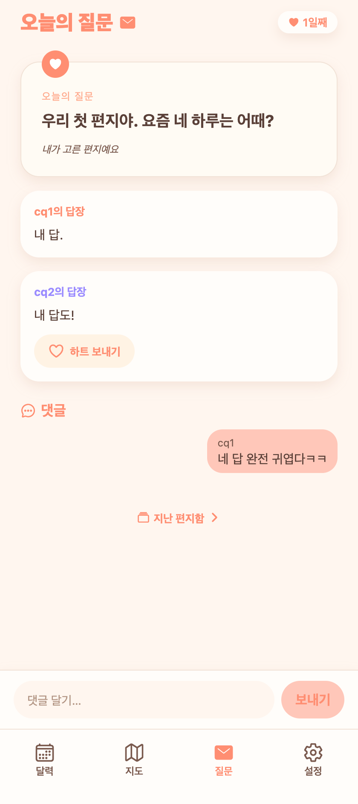
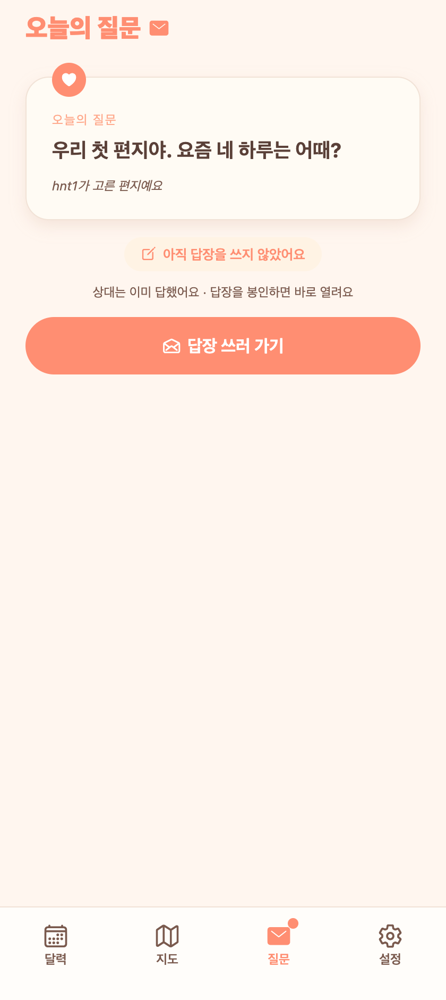

# 27. 오늘의 질문 — 댓글 & 상대 답변 즉시 열림

## 요청
1. 오늘의 질문에도 일기처럼 **댓글**을 달 수 있게.
2. 상대가 이미 답한 질문에 내가 답하면 **바로 상대 답을 볼 수 있게** 자연스러운 흐름.

## 무엇을 했나
### 1) 댓글 (열린 편지)
- 편지가 **열린 상태(둘 다 답장)**에서 두 사람이 댓글을 주고받음. 일기 댓글 구조를 그대로 미러링.
- 백엔드: `QuestionComment`(엔티티/리포), `POST /api/questions/daily/comment`(열림 아니면 400), `today`(OPENED)·`archive/{date}` 응답에 `comments`, 상대에게 `QUESTION_COMMENT` 알림.
- 프론트: 열린 편지·지난 편지 상세에 **댓글 목록 + 입력바("댓글 달기…"·보내기)**. 편지 감성(연코럴 말풍선).

### 2) 상대 답변 즉시 열림
- 원래도 내가 답을 봉인하면 상대가 이미 답했을 경우 곧바로 OPENED가 됐지만, **기대를 명확히** 하려고:
- 백엔드: `NEEDS_ANSWER` 응답에 `partnerSealed`(상대 답 봉인 여부, 텍스트 미노출) 추가.
- 프론트: 상대가 이미 답했으면 **"상대는 이미 답했어요 · 답장을 봉인하면 바로 열려요"** 힌트(답장 화면에도). 봉인 즉시 상대 답이 열림.

## QA (실계정 E2E)
- 댓글 등록 → 상대 `comments` 반영·`QUESTION_COMMENT` 알림 ✔, 열림 전 댓글 → 400 ✔
- `NEEDS_ANSWER`에 `partnerSealed=true` 노출 ✔, 답장 직후 즉시 `OPENED`+상대답 공개 ✔

## 화면

**열린 편지 — 두 답장 + 하트 + 댓글 섹션·입력바**

**상대가 이미 답했을 때 — 힌트**

