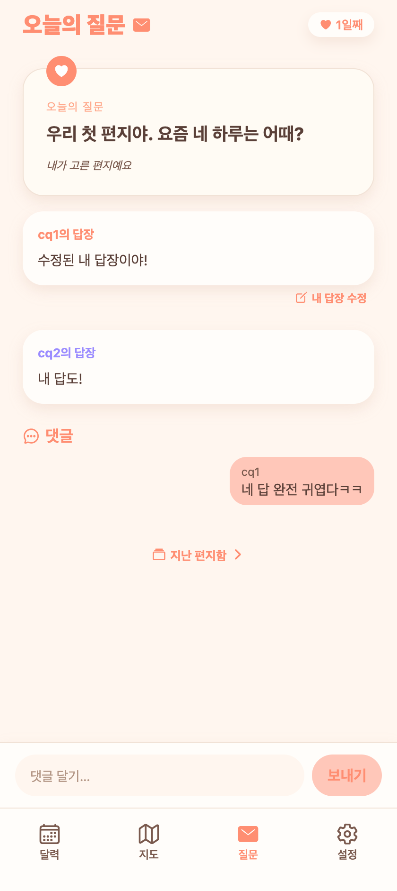
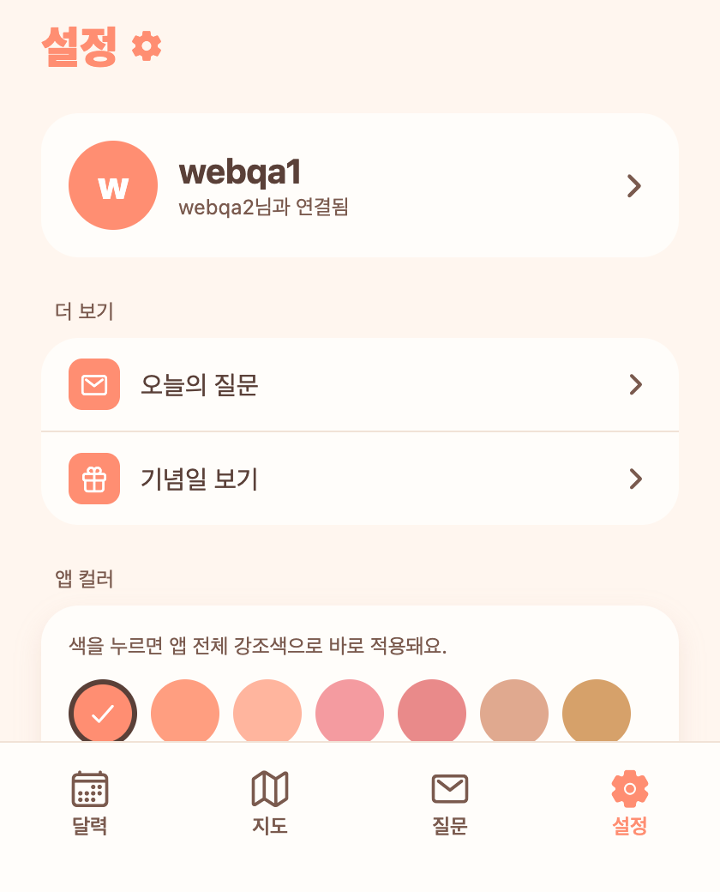
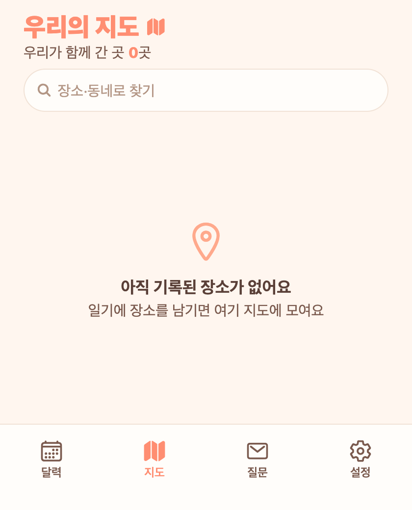

# 28. UI 정리 묶음 (질문 하트/수정 · 일기 배지 · 지도 카드 · 헤더 통일)

여러 요청을 한 묶음으로 처리.

## 1) 오늘의 질문
- **하트 보내기 제거** — 열린 편지의 반응(하트) UI 삭제.
- **내 답변 수정** — 봉인 후에도 답장 텍스트를 고칠 수 있음. 열림/대기 화면에 '수정' 진입, 답장 화면이 기존 답을 프리필하고 '답장 수정하기'로 저장(재알림 없음).

**열린 편지 — 하트 없음 + '내 답장 수정' 링크 + 댓글**

## 2) 일기 — 기념일 마크 배지
캘린더에 콕 찍어둔 마크(100일·커스텀 등)의 라벨이 그 날짜 일기 상단에 배지로 표시(기존엔 매년 반복 기념일/생일만 떠서 마크한 날엔 아무 표시 없던 버그).

## 3) 지도
- 선택 카드의 **닫기(X) 제거** — 지도 빈 곳 탭으로 닫힘.
- 카드를 **흐름 배치**로 바꿔 지도(flex)가 자동으로 줄어 **카드와 겹치지 않음**.
- **리스트에도 별명 표시** — 별명 있으면 별명(제목)+장소명(부제).

## 4) 탭 헤더 통일
love today(홈)·오늘의 질문 결에 맞춰 **지도·설정**도 강조색 굵은 제목 + 아이콘으로. 질문/지도/설정 크기 26으로 통일(홈은 앱 로고 28).

**설정 / 지도 헤더**

## QA
- 질문: 답변 수정 E2E(OPENED 유지·내 답만 갱신·재알림 없음), 하트 사라짐·수정 링크(web) ✔
- 일기: 마크 날짜에 '우리 100일' 배지(web) ✔
- 지도: tsc 통과(카카오 지도는 WebView라 폰에서 최종 확인) — X 제거·흐름배치·리스트 별명 코드 반영
- 헤더: 설정·지도 강조색 제목 통일(web) ✔
