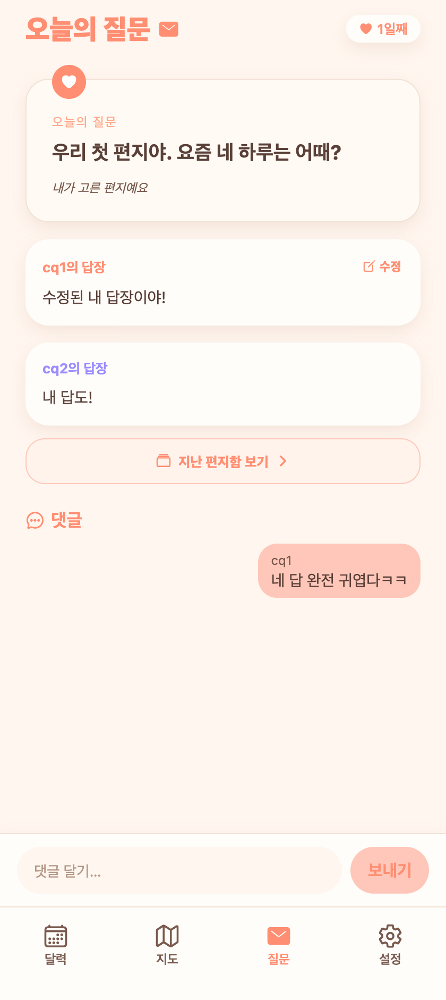

# 30. 오늘의 질문 — 지난 편지함 B위치 + 수정 카드 내 배치

## 요청
- 지난 편지함을 **B(답장 바로 아래·댓글 위)**로.
- '내 답장 수정'을 카드 밖 별도 줄 대신 **카드 공간 안**으로(안 삐져나오게).

## 반영
- **지난 편지함**: 헤더 편지함 버튼(29의 A안) 원복 → 두 답장 아래·댓글 위에 '🗂 지난 편지함 보기 ›' 카드. 댓글이 많아도 항상 같은 위치.
- **수정 위치**: 답장 카드 헤더 우측에 작은 '✏ 수정'(열림·대기 공통). 별도 줄 제거로 카드 밖으로 안 삐져나옴. (AskUserQuestion: '카드 헤더 우측 수정' 선택)

## QA
- web: 답장 카드 헤더 '수정' 인라인, '지난 편지함 보기' B위치, tsc 0 ✔
