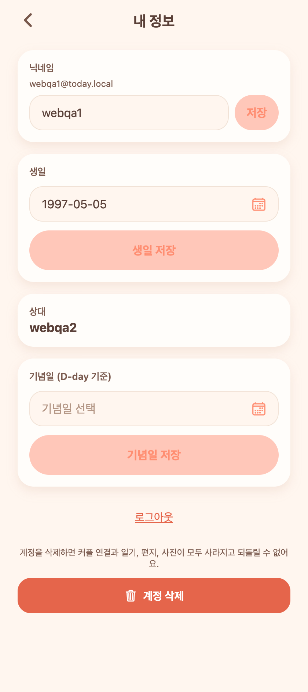
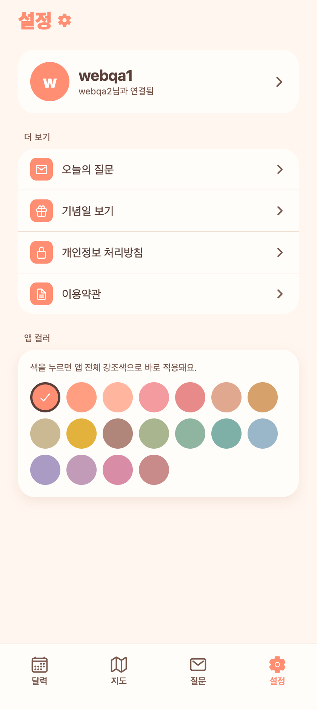

# 31. 앱스토어 출시 준비 배치

서브에이전트 4개로 출시 필수 항목을 한 번에 정비했다. 앱 동작 관점에서 바뀐 것과, 아직 사람이 직접 해야 하는 것으로 나눠 기록한다.

## 앱에서 바뀐 것 (사용자가 체감)
- **계정 삭제**: 내 정보 화면 맨 아래 위험 구역 추가. "계정을 삭제하면 커플 연결과 일기·편지·사진이 모두 사라진다" 안내 + 빨간 '계정 삭제' 버튼. 2단계 확인 후 서버에서 커플/일기/편지/사진/알림까지 FK 순서대로 전부 지우고 로그아웃. (애플 5.1.1 앱 내 계정 삭제 필수)
- **개인정보 처리방침 / 이용약관**: 설정 '더 보기'에 두 항목 추가 → 각각 전용 화면으로 이동. (지금은 본문 자리표시자, 전문은 docs/release에 완성됨)

## 서버에서 바뀐 것
- `DELETE /api/me`: 로그인 사용자 계정과 관련 데이터 전부 삭제(트랜잭션, FK 안전 순서). 자식→부모 순으로 정리 후 마지막에 User 삭제. 커플 상대는 자동으로 커플 해제 상태가 됨.

## 설정/빌드 파일
- `app.json`: iOS 번들 ID(`trade.hammerslog.today`), 빌드 번호, 권한 설명 문구(사진·위치), 암호화 면제 플래그, 스플래시 플러그인.
- `eas.json`(신규): development/preview/production 빌드 + 제출 프로필. (애플 계정·앱 ID·API 주소는 자리표시자)

## 문서 (docs/release/ 01~09)
스토어 메타데이터, 개인정보 라벨, 개인정보 처리방침 전문, 이용약관 전문, 에셋 규격, 출시 런북, 심사 주의점, 준비도 점검, 운영 백엔드 요건.

## 아직 사람이 해야 하는 것 (출시 전 필수)
1. **Sign in with Apple** — 카카오 로그인만 있어 애플 가이드라인 4.8에 걸림(반려 위험 높음). 미구현.
2. **운영 백엔드 호스팅** — 지금은 터널. 고정 도메인/HTTPS 필요.
3. **개인정보 처리방침 공개 URL** — 스토어 커넥트에 넣을 실제 웹주소.
4. **심사용 데모 계정** + eas.json/번들ID/API주소 자리표시자 채우기.

## QA
- 프론트 `tsc` 0, 백엔드 컴파일 0, 부팅 0 에러, web export 성공.
- 계정 삭제 E2E: `DELETE /api/me` → 204, 삭제 후 본인 401·상대 커플해제 확인.
