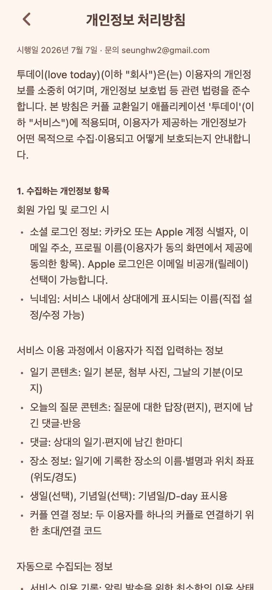
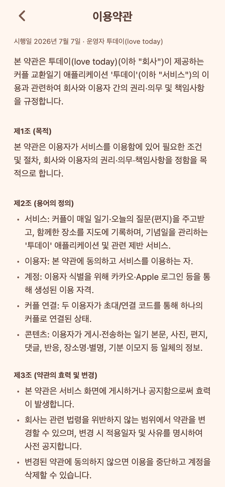

# 33. 개인정보 처리방침·이용약관 본문 채우기

기존에 자리표시자("여기에 전문")였던 두 법적 화면에 실제 전문을 넣었다. 이제 앱 안에서 방침·약관을 온전히 읽을 수 있다.

## 바뀐 것
- **설정 → 개인정보 처리방침 / 이용약관**을 누르면 자리표시자 대신 **전체 조문**이 소제목·불릿으로 정리돼 보인다.
- 문서에 카카오만 있던 부분을 **Apple 로그인까지 반영**(수집 항목·제3자, 계정 정의 등). Apple 이메일 비공개(릴레이) 선택 가능도 명시.
- 시행일 2026년 7월 7일, 문의 seunghw2@gmail.com, 운영자 "투데이(love today)"로 채움.

## 구조
- 공용 렌더러 `components/LegalDoc.tsx`(뒤로가기 헤더 + 절 목록).
- 본문 데이터 `lib/legal.ts` 한 곳에 모음. **운영자명/문의/시행일은 상수 3개만 바꾸면** 두 화면·모든 조문에 반영된다.
- 화면 파일(privacy/terms)은 데이터만 주입하는 5줄짜리로 축소.

## QA
- 프론트 `tsc` 0.
- Expo Web + Playwright로 두 화면 실제 렌더 확인.

## 확인 필요(사람)
- 문의 이메일/운영자명을 실제 운영값으로 쓸지 확인(현재 개인 gmail). 사업자로 낼 경우 상호/책임자 반영.
- 앱 내 전문과 별개로, App Store Connect엔 **공개 URL**이 필요하다(docs/release/03을 웹에 올려 그 주소 입력).
