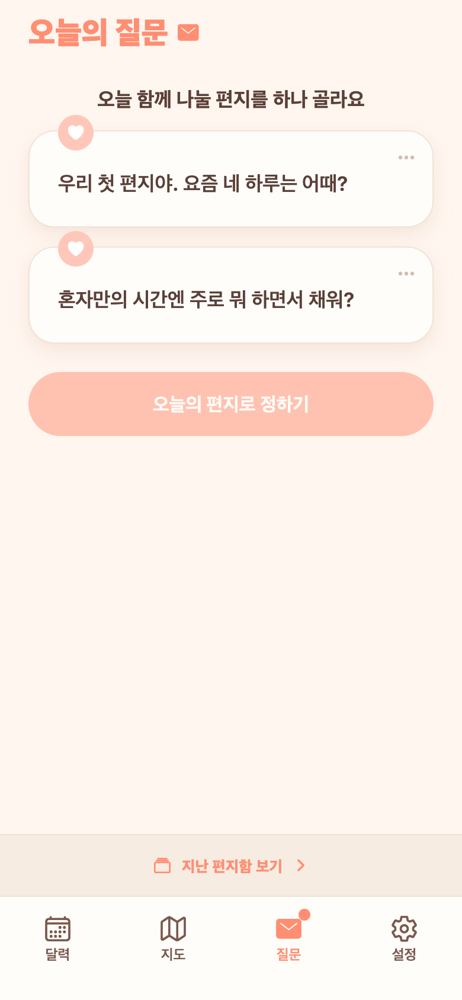

# 35. 지난 편지함 — 하단 고정 바

## 문제
답장 쓰기 전(편지 선택·답장 대기 등) 상태에서는 '지난 편지함 보기'가 두 답장 아래(B위치)에만 있어 화면에 안 나왔다. 즉 그 상태에선 지난 편지를 볼 방법이 없었다.

## 반영 (목업 3안 중 2번 선택)
- **탭바 바로 위에 항상 떠 있는 '지난 편지함 보기 ›' 바**를 추가. 스크롤과 무관하게 늘 같은 자리, 본문과 시각적으로 분리(옅은 크림 띠 + 상단 경계선).
- OPENED(둘 다 열린) 상태는 **제외** — 이미 본문 인라인 링크가 있고 하단은 댓글 입력바가 차지하므로 이중 바를 피함.
- 결과: 커플 연결된 모든 상태에서 편지함 접근 가능(미연결 상태만 제외).

## 목업 비교
`docs/planning/letterbox-mockups/`에 3안(우상단 버튼 / 하단 고정 바 / 카드 위 띠) 저장.

## QA
- 프론트 `tsc` 0.
- Expo Web로 편지 선택(NEEDS_CHOICE) 상태에서 하단 바 노출 확인 — 기존엔 없던 진입점.
