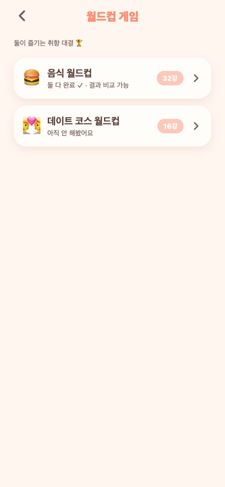
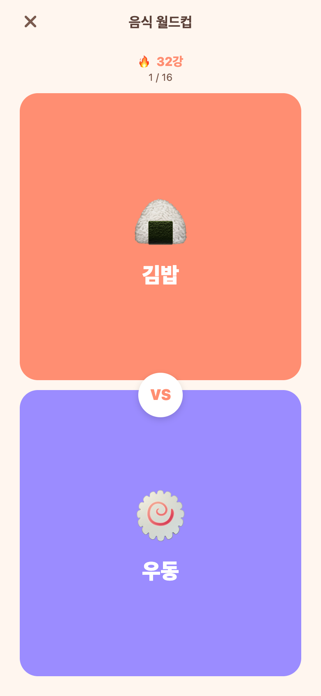
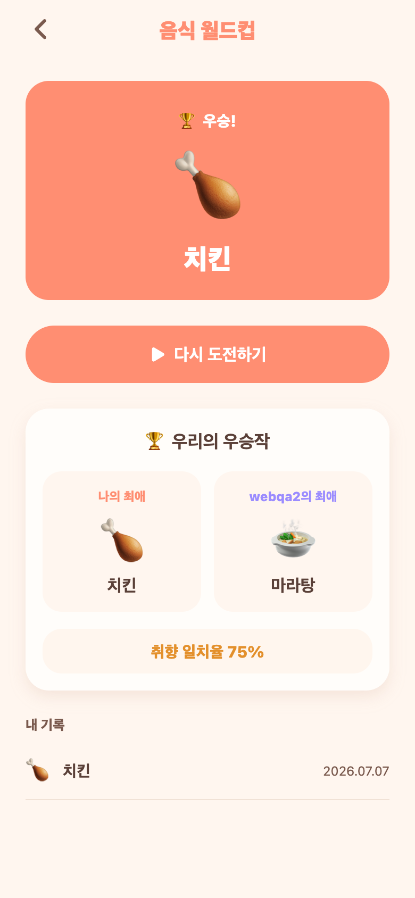

# 37. 월드컵 미니게임 (설정 탭)

이상형(음식) 월드컵을 설정 탭 미니게임으로 추가. 목업 A(상하 VS 탭) + 커플 비교 결과 방향으로 구현.

## 흐름
설정 → **월드컵 게임** → 월드컵 선택 → 진행하기 / 이전 기록 보기 → 대결(상하 VS 탭) → 우승 → **커플 비교**

## 사용자가 보는 것
- **홈**: 월드컵 목록(음식 32강, 데이트 코스 16강). 각 항목에 "둘 다 완료 · 결과 비교 가능 / 내 기록 있음 / 아직 안 해봤어요" 상태 표시.
- **대결**: 위·아래 두 후보 큰 카드 중 하나를 탭. 상단에 라운드(🔥 32강)·진행(1/16). 32강→16강→…→결승→우승.
- **결과**: 🏆 우승작 축하 배너 + '우리의 우승작' — 나의 최애 vs 상대의 최애 + **취향 일치율**(4강 겹침 기반). 둘 다 완주하면 자동 비교. + 내 기록 목록.

## 구조
- **백엔드**: 정적 카탈로그(`WorldcupCatalog`, 코드에 아이템 고정) + `WorldcupResult` 엔티티(유저·커플·우승·4강 저장). `GET /api/worldcups`(목록·완주여부), `GET /{key}`(후보), `POST /{key}/result`, `GET /{key}/records`(내 기록+커플 비교). 계정 삭제 캐스케이드에 결과 정리 추가.
- **취향 일치율**: 두 사람의 4강 진출자 id 겹침 / 4 (%).
- **프론트**: 토너먼트 진행은 클라이언트(셔플→상하 대결→라운드 진행, 4강 진출자 기록). 화면 3개(홈·상세/결과·대결).
- 월드컵 추가는 카탈로그에 목록만 더하면 됨(음식/데이트 외 확장 쉬움).

## QA
- 백엔드 컴파일 0·부팅 0에러. API E2E: 목록/상세(32개)/결과 저장(201)/기록·비교 확인.
- 커플 비교 검증: 나 top4[1,5,11,20] vs 상대[5,1,11,7] → 겹침 3개 → **일치율 75%** 정확.
- 프론트 tsc 0. Expo Web로 홈·대결·결과 3화면 렌더 확인(위 캡처).

## 남은 여지(후속)
- 아이템에 실제 이미지(지금은 이모지), 월드컵 종류 추가, "상대가 월드컵 했어요" 알림, 진행 중 이탈 시 이어하기 등.
