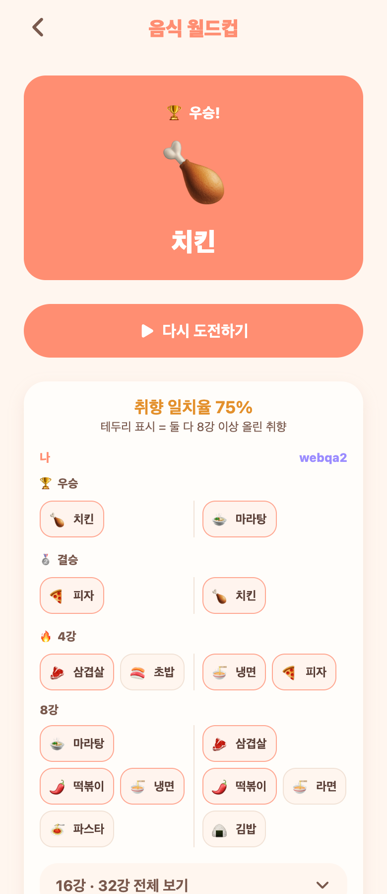
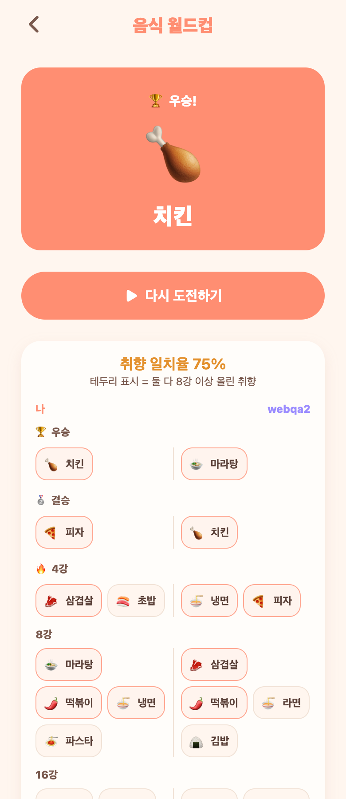

# 38. 월드컵 결과 — 32강 전체 여정 비교 (라운드 아코디언)

우승만 비교하던 결과 화면을, 각자의 **우승→32강 전체 여정**을 그림+이름으로 나란히 비교하도록 확장. (선택 목업: 1번 라운드 아코디언)

## 사용자가 보는 것
- 결과 화면에 '취향 일치율 %' + 나 / 상대 두 열.
- **우승·결승·4강·8강**은 그림+이름 칩으로 펼쳐서, 각자가 올린 취향을 나란히.
- 둘 다 8강 이상에 올린 취향은 **테두리로 강조**(공통 취향).
- **16강·32강**은 접어두고 '전체 보기' 탭하면 펼쳐짐 → 화면이 차분함.

## 구조 변경
- **저장 데이터 확장**: 우승·4강만 저장하던 걸 → **라운드별 탈락 아이템 전체**(우승~32강)로. 진 쪽은 그 라운드 사이즈로 탈락 기록(예: 32강 라운드에서 지면 stage=32).
  - `WorldcupResult.stages`("stage:idCsv;…") 한 컬럼에 통째로.
  - 대결 진행(클라이언트)이 매 판 패자의 탈락 라운드를 기록해 전송.
- **비교 응답**: 각 사람의 라운드별 그룹(Journey) + 취향 일치율(8강 이상 겹침) + 공통 취향 목록.
- 스키마 변경으로 기존 worldcup_results(테스트분)는 초기화.

## QA
- 백엔드 컴파일 0·부팅 0에러. E2E: 32개 stages 저장→기록 응답에서 라운드별 그룹·일치율 75%·공통 6개 정확.
- 프론트 tsc 0. Expo Web로 접힘/펼침 렌더 확인(위 캡처).

## 남은 여지
- 아이템 실제 일러스트 이미지(지금은 이모지), 라운드 애니메이션, 상대 미완주 시 안내 문구 등.
