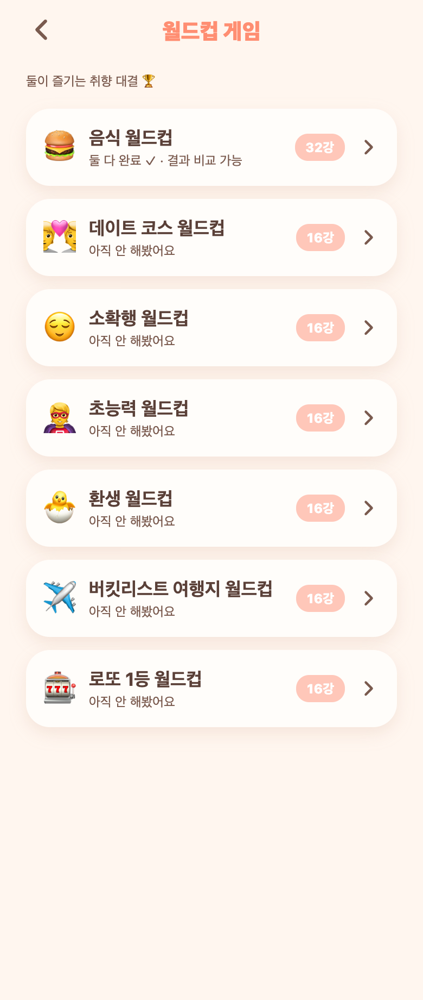

# 39. 월드컵 주제 5개 추가 (20-30대 취향)

인터넷 인기 주제(편의점·야식·여행지·넷플릭스·초능력·소확행·밸런스게임 등)를 참고해, 진부하지 않고 커플이 취향을 나누기 좋은 5개를 추가.

## 추가된 월드컵 (각 16강)
- **😌 소확행 월드컵** — 갓 구운 빵, 주말 늦잠, 첫눈, 빗소리, 폭신한 낮잠…
- **🦸 초능력 월드컵** — 순간이동, 투명인간, 시간 정지, 독심술, 미래 보기…
- **🐣 환생 월드컵** — 고양이, 돌고래, 구름, 판다, 유니콘, 다시 사람…
- **✈️ 버킷리스트 여행지 월드컵** — 파리, 뉴욕, 발리, 산토리니, 오로라 마을…
- **🎰 로또 1등 월드컵** — 건물주, 세계일주, 즉시 퇴사, 통 큰 기부, 일단 펑펑…

기존 음식(32강)·데이트 코스(16강) 포함 총 7개.

## 구조
- 백엔드 정적 카탈로그(`WorldcupCatalog`)에 목록만 추가. 프론트/DB 변경 없음(목록·진행·비교 전부 자동).
- 주제·아이템 추가는 앞으로도 카탈로그에 배열만 더하면 됨.

## 참고 출처
- [이상형 월드컵 - 나무위키](https://namu.wiki/w/%EC%9D%B4%EC%83%81%ED%98%95%20%EC%9B%94%EB%93%9C%EC%BB%B5)
- [이상형 월드컵/목록 - 나무위키](https://namu.wiki/w/%EC%9D%B4%EC%83%81%ED%98%95%20%EC%9B%94%EB%93%9C%EC%BB%B5/%EB%AA%A9%EB%A1%9D)
- [PIKU 이상형 월드컵(편의점·넷플릭스·여행지 등 인기 주제)](https://www.piku.co.kr)

## QA
- 백엔드 컴파일 0·부팅 0에러. `GET /api/worldcups` 7개, 신규 5개 각 16 아이템 확인.
- Expo Web로 홈 목록 렌더 확인(위 캡처).
