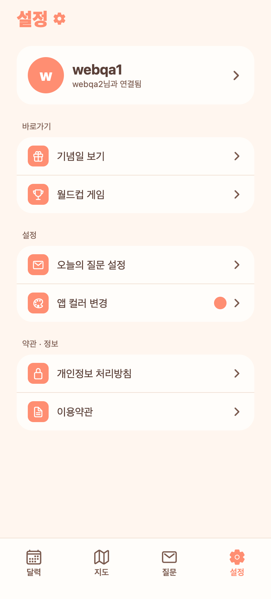
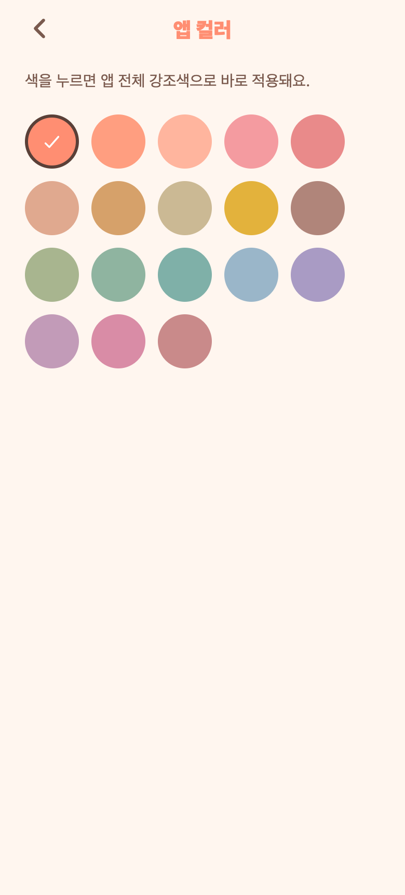

# 40. 설정 화면 개편 — 카테고리 정리 + 앱 컬러 별도 화면

## 요청
- 앱 컬러를 설정에 바로 깔지 말고 '앱 컬러 변경' 행 → 별도 화면에서 색 선택.
- 설정 항목을 카테고리별로 여백 나눠 정리.
- (선택 목업: A 섹션 그룹 카드)

## 반영
- **앱 컬러 분리**: 설정에 '앱 컬러 변경' 행(우측에 **현재 색 미리보기 dot** + ›) → 탭하면 **앱 컬러 화면**으로. 색 목록은 그 화면에 있고, 현재 색엔 체크 표시.
- **카테고리 정리**(그룹 카드 + 라벨 + 여백):
  - **바로가기**: 기념일 보기 · 월드컵 게임
  - **설정**: 오늘의 질문 설정 · 앱 컬러 변경
  - **약관 · 정보**: 개인정보 처리방침 · 이용약관
- **이름 명확화**: '오늘의 질문' → **'오늘의 질문 설정'** (실제로 질문 도착시간·알림 등 설정 화면으로 가는 항목이라 혼동 줄임) + '설정' 카테고리로 이동.

## 구조
- 신규 화면 `app/app-color.tsx`(라우트 `/app-color`) — 스와치 팔레트 이동.
- 설정 화면은 인라인 컬러 카드 제거, 3개 그룹 카드로 재배치.

## QA
- 프론트 tsc 0. Expo Web로 설정·앱 컬러 화면 렌더 확인(위 캡처).
