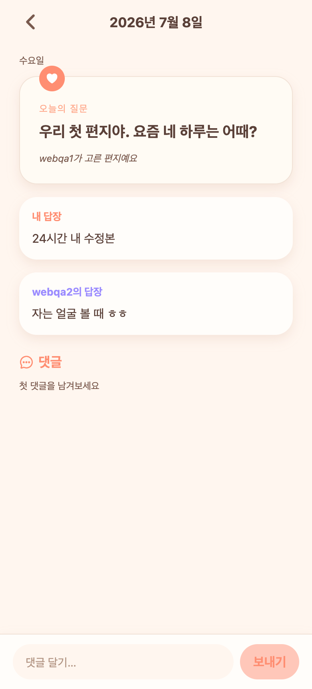

# 41. 지난 편지함에서 답장이 계속 "봉인"으로 뜨던 버그 수정

## 증상
지난 편지함(아카이브)에서 예전 질문을 열면, 이미 양쪽 다 답해 열렸던 편지인데도
내 답장·상대 답장이 모두 "봉인된 채 남겨진 편지예요."로만 보였다.

## 원인
프론트 `question/[date].tsx`의 답장 카드가 `sealed || !text`이면 봉인 문구를 띄웠는데,
`sealed`는 "봉인 제출됨"을 뜻해 **답장이 있으면 항상 true**다. 그래서 서버가 내용을
정상적으로 내려줘도(내 답장은 항상, 상대 답장은 열린 편지만) 화면에서 무조건 가려버렸다.
→ 데이터는 멀쩡한데 표시만 가려진 버그.

## 수정
조건을 `!text`로만 변경 — 내용이 있으면 항상 보여주고, 없을 때만 봉인 문구.
공개 정책(내 답장 항상 / 상대 답장은 그때 둘 다 답한 편지만)은 서버 로직 그대로 유지.

## QA
- 백엔드 확인: 열린 편지의 아카이브 응답에 myAnswer.text·partnerAnswer.text 정상 포함(sealed=true지만 text 있음).
- 프론트 tsc 0. Expo Web로 아카이브 상세에서 실제 답장 노출 확인.

