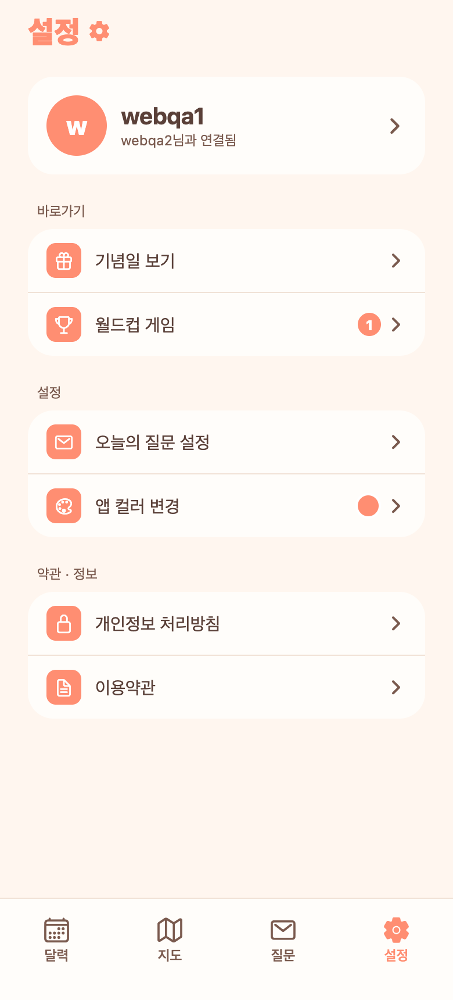

# 43. 월드컵 완주 → 상대 알림 + 설정 배지

## 요청
- 월드컵 게임을 완료하면 상대에게 알림.
- 설정에 작게 숫자 배지(1) 표시.

## 결정(AskUserQuestion)
- 배지 위치: **설정의 '월드컵 게임' 행에만**
- 배지 의미: **상대가 새로 완료한 수** (월드컵 목록 열면 사라짐)
- 알림 시점: **완료할 때마다**

## 반영
- **완주 알림**: 내가 월드컵을 끝내면 상대에게 "OO님이 월드컵을 완주했어요 · 🏆 환생 월드컵 · 우승 강아지" 알림. 알림함(종)에도 뜨고, 탭하면 월드컵 화면으로.
- **설정 배지**: 설정 '월드컵 게임' 행 오른쪽에 **상대가 새로 완료한 수**를 코럴 원형 숫자 배지로. 내가 월드컵 목록을 열면 서버에서 읽음 처리돼 배지가 사라짐. (내 완료는 내 배지를 올리지 않음)

## 구조
- 백엔드: `NotificationType.WORLDCUP_COMPLETED` 추가, `WorldcupService.saveResult`에서 상대에게 알림 트리거. 배지용 `GET /api/worldcups/unseen`(미읽음 완주 수) · `POST /api/worldcups/seen`(읽음 처리). 배지 수 = 미읽음 WORLDCUP_COMPLETED 알림 수라 알림함과 자연스럽게 연동.
- 프론트: 설정이 focus 때 unseen 조회해 배지 표시, 월드컵 홈 진입 시 markSeen 호출.

## QA
- 백엔드 컴파일 0·부팅 0에러. E2E: 상대 완료 시 unseen 0→1→2, 알림 생성 확인, markSeen 후 0, 내 완료는 내 배지 미변동.
- 프론트 tsc 0. Expo Web로 설정 '월드컵 게임' 행 배지(1) 렌더 확인.
