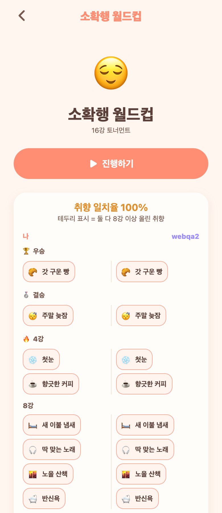

# 44. 월드컵 완료 처리 — '비교 가능' 알림 + 알림 딥링크

앞서 붙인 완주 알림/배지에 두 가지를 더해 완성도를 높였다. (선택: 알림→해당 결과로 바로 / '비교 가능' 알림 추가)

## 반영
- **'비교 가능' 알림**: 내가 월드컵을 끝냈는데 **상대도 이미 그 월드컵을 끝냈다면**, 상대에게 완주 알림 대신 "결과를 비교할 수 있어요 · 이제 OO님과 소확행 월드컵 결과를 비교해봐요 🏆" 알림. 비교가 열리는 순간을 정확히 알려준다.
  - 상대가 아직 안 했으면 기존 "OO님이 월드컵을 완주했어요" 그대로.
- **알림 딥링크**: 월드컵 알림을 탭하면 목록이 아니라 **그 월드컵 결과 비교 화면으로 바로**. (알림에 월드컵 key를 담아 `/worldcup/<key>?compare=1`로 이동 → 상세가 비교를 자동으로 펼침)
- 설정 배지는 완주+비교가능 알림을 함께 카운트.

## 구조
- 백엔드: `NotificationType.WORLDCUP_COMPARABLE` 추가, `Notification.refKey`(딥링크 참조키) 컬럼 추가. `WorldcupService.saveResult`가 상대 완주 여부로 완주/비교가능을 분기.
- 프론트: 알림 탭 → refKey로 해당 월드컵 상세(비교 자동 열기). 상세는 `compare=1` 파라미터로 결과를 바로 펼침.

## QA
- 백엔드 컴파일 0·부팅 0에러. E2E: 상대 미완주→WORLDCUP_COMPLETED(refKey), 상대 완주→WORLDCUP_COMPARABLE("결과를 비교할 수 있어요", refKey), 배지 두 타입 합산.
- 프론트 tsc 0. Expo Web로 `?compare=1` 딥링크가 결과 비교를 즉시 펼침 확인.

