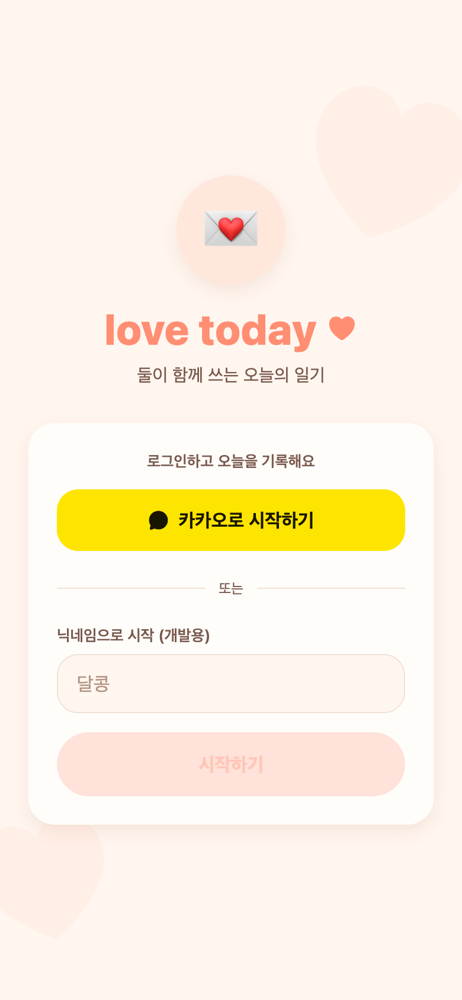

# 47. 로그인 화면 리디자인 + 브랜드 love today 통일

## 요청
- 로그인 화면 예쁘게
- 앱 이름 = **love today** (홈화면 이름도 투데이 → love today)

## 반영
- **로그인 리디자인**: 💌 엠블럼(소프트 코랄 원) + `love today ♥` 로고 + 태그라인 + 은은한 배경 하트 2개 + 카드 상단 '로그인하고 오늘을 기록해요' 인트로. 휑하던 여백이 채워지고 따뜻해짐.
- **브랜드 통일 → love today**: 로그인·홈 로고 '투데이' → `love today`, app.json `name` '투데이' → `love today`(홈화면 앱 이름).

## QA
- 프론트 tsc 0. Expo Web로 로그인 렌더 확인(아래).

## ⚠️ 반영 시점
- **홈화면 앱 이름·로고 변경은 새 EAS 빌드 후** TestFlight/기기에 나타남(현재 빌드엔 이전 값). 다음 빌드 때 함께 적용.
