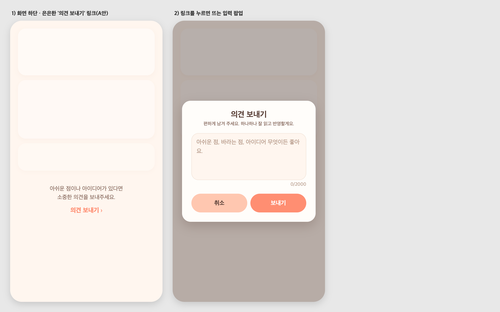

# 55 · 화면 하단 '의견 보내기' 진입점 + 입력 팝업

## 배경
사용자가 아쉬운 점·아이디어를 손쉽게 남길 수 있는 진입점이 필요했다. 참고 앱(파워업)처럼
**콘텐츠 맨 아래 은은한 텍스트 링크(A안)** 를 얹고, 누르면 **팝업**으로 바로 입력·전송하도록 했다.

## 동작
- 화면을 끝까지 내리면 "아쉬운 점이나 아이디어가 있다면 소중한 의견을 보내주세요."
  아래에 **의견 보내기 ›** 링크가 보인다.
- 링크를 누르면 앱 톤(코럴&크림) 팝업이 뜨고, 자유롭게 적어 **보내기** 하면 저장된다.
  성공 시 "소중한 의견 고마워요. 잘 살펴볼게요 💌" 토스트.
- 빈 내용은 전송되지 않고, 실패하면 사유를 알림으로 안내한다. 최대 2000자.

## 표시 위치
- 오늘의 질문 탭 (`source=question`)
- 우리 사주 궁합 허브 (`source=saju`)
- 사주 오늘의 운세 상세 (`source=saju_today`)

`source` 값으로 어느 화면에서 보낸 의견인지 함께 기록한다.

## 서버
- 새 `feedback` 도메인(엔티티·리포지토리·서비스·컨트롤러) 추가.
  `POST /api/feedback {content, source}` → 저장(작성자·내용·화면·시각).
- 로컬 검증: 정상 204 저장 확인, 빈 내용 400 차단 확인.

## 화면

*왼쪽: 콘텐츠 하단의 은은한 링크 / 오른쪽: 링크를 누르면 뜨는 입력 팝업*
