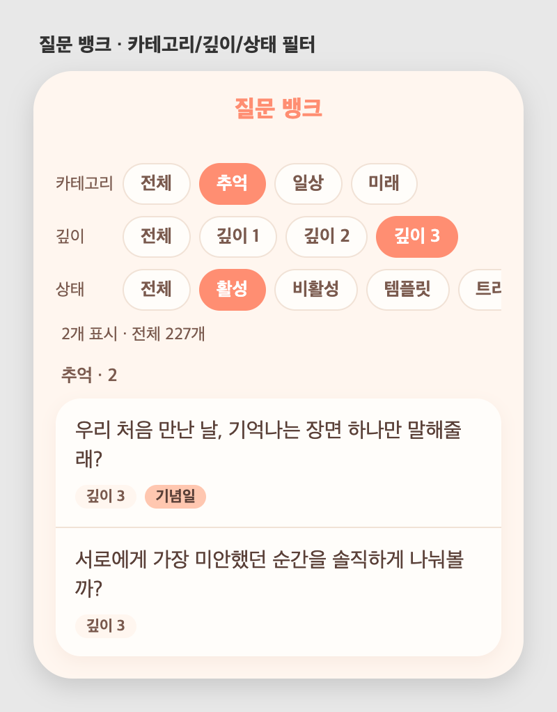

# 57 · 질문 뱅크 필터

## 동작
질문 뱅크 상단에 필터 바를 추가했다. 조건을 조합하면 목록이 즉시 좁혀지고,
"N개 표시 · 전체 227개"로 결과 수를 보여준다.

- **카테고리** — 전체 / 일상·추억·미래 등(데이터에 있는 카테고리 자동 노출)
- **깊이** — 전체 / 깊이 1·2·3
- **상태** — 전체 / 활성 / 비활성 / 템플릿 / 트리거(기념일 등) / 미사용

세 필터는 함께 적용된다(AND). 예: 카테고리=추억 + 깊이 3 + 활성.

## 화면

*카테고리·깊이·상태 칩으로 즉시 필터링*
