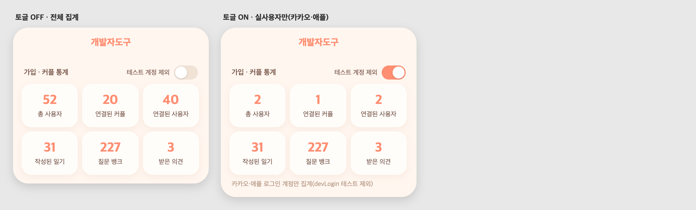

# 58 · 통계 '테스트 계정 제외' 토글

## 배경
가입·커플 통계에 그동안 만든 QA·dev 테스트 계정이 섞여 실제 규모를 알기 어려웠다.
(전체 사용자 52명 중 실제 로그인 계정은 2명뿐)

## 동작
개발자도구 홈 '가입·커플 통계'에 **테스트 계정 제외** 토글을 추가했다.
- 켜면 총 사용자·연결된 커플·연결된 사용자가 **실사용자 기준**으로 바뀐다.
- 실사용자 = **카카오·애플 로그인 계정**(devLogin 테스트 계정 제외).
- 작성된 일기·질문 뱅크·받은 의견은 그대로 둔다.

예: 52명 → 2명, 커플 20 → 1, 연결된 사용자 40 → 2.

## 서버
`/api/dev/stats`에 실사용자 카운트(usersReal/couplesReal/coupledUsersReal) 추가.
커플은 두 멤버 모두 실사용자인 경우만 집계. 검증 완료.

## 화면

*왼쪽: 전체 집계 / 오른쪽: 토글 켜서 실사용자만*
