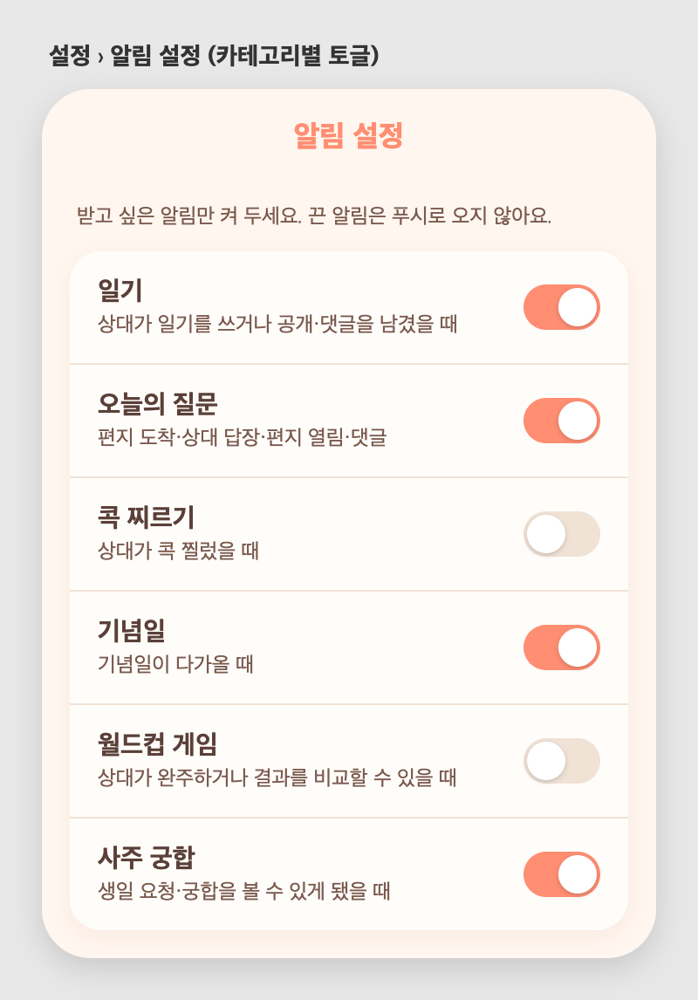

# 59 · 사주 다듬기 + 알림 설정

여러 피드백을 한 번에 반영했다.

## 오늘의 운세 배너 (사주 허브)
- 오른쪽 색 이름('상큼한 주황') 글자 제거.
- 배너 문구를 상세 화면 헤드라인('곳곳에서 ~')과 동일하게 맞춤.
- 참고: 오늘의 운세는 그날의 일진(日辰)으로 계산돼 **매일 바뀐다.**

## 우리 궁합
- 항목별 궁합의 '자세히 보기/접기'를 없애고 설명을 **항상 전부** 노출.
- 설명에 **오행(사주) 근거**를 더함. 예: "근육남친님의 일간은 수(水), 요정체리님은 목(木) 기운이라
  서로를 살리는 상생(相生)의 결…", "~는 목이 넉넉하고 ~는 금이 도드라져 상보(相補) 관계"처럼
  실제 오행 분포를 짚어 전문성을 유지.
- 대표 한줄을 긍정 톤으로 교체(예: "표현이 숙제인 사이" → "말 한마디만 더하면 완벽해지는 사이").
- 맨 아래 '재미로 보는 사주예요' 문구에 줄바꿈 추가.

## 내 사주
- '오늘의 기운'과 '사주 자세히 보기' 섹션 제거(핵심 해석만 남김).

## 사주 허브
- '연인 사주 보기' → '{상대 닉네임}님 사주 보기'로 표기.

## 알림 설정 (신규)
전체 탭 › **알림 설정**에서 카테고리별로 푸시를 켜고 끌 수 있다.
- 일기 / 오늘의 질문 / 콕 찌르기 / 기념일 / 월드컵 게임 / 사주 궁합
- 끈 카테고리는 원격 푸시가 오지 않는다(인앱 알림 목록에는 기록은 남음).
- 서버: 카테고리별 on/off 저장(`/api/notification-settings`), 발송 시 수신자 설정 확인.
- 검증: 기본 전부 켜짐, 저장·재조회 반영, 관리자 계정으로 확인 완료.

*설정 › 알림 설정 — 받고 싶은 알림만 토글*
