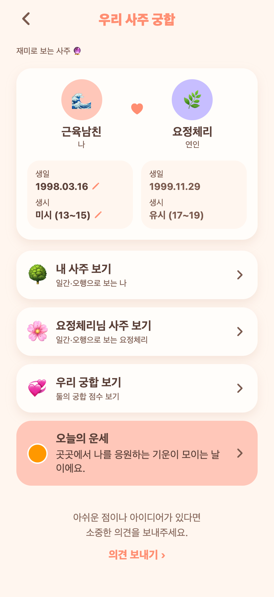
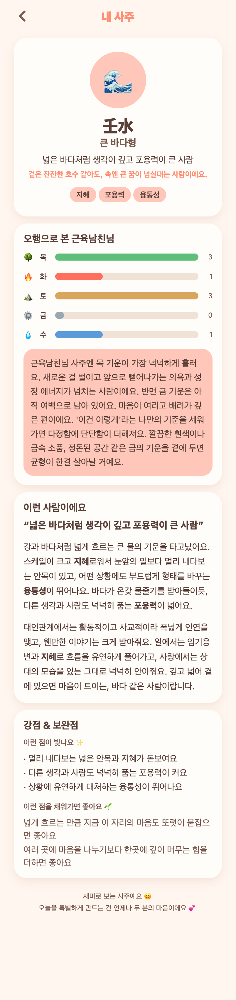
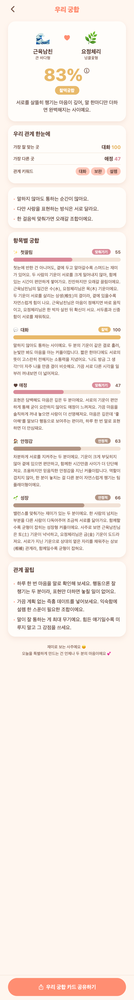

# 60 · 실제 앱 캡처로 검증·정리

그동안 devlog 캡처가 HTML 목업이었어서, Expo Web + Playwright로 **실제 앱**을 띄우고
관리자 계정(근육남친)으로 로그인해 실제 화면을 다시 찍었다.
55~59의 목업 이미지는 모두 이 실제 캡처로 교체했다.

## 실제 화면으로 확인한 것
- **사주 허브**: '연인 사주 보기' → '요정체리님 사주 보기', 오늘의 운세 배너에 색 이름 없이
  '곳곳에서 ~' 문구.
- **내 사주**: '오늘의 기운'·'사주 자세히 보기' 섹션 제거됨.
- **우리 궁합**: 항목별 설명 전체 노출(자세히보기 없음), 오행 근거(일간 수/목 상생, 토/금 상보),
  대표 한줄 긍정 톤, 맨 아래 문구 줄바꿈.
- **알림 설정 / 개발자도구 / 질문 뱅크 필터 / 의견 보내기 팝업**: 정상 동작.

## 캡처

*사주 허브 — 요정체리님 사주 보기 + 오늘의 운세 문구*

*내 사주 — 오늘의 기운·자세히 보기 제거*

*우리 궁합 — 오행 근거 + 긍정 대표한줄 + 전체 노출*

## 방법(재현용)
- 백엔드 `localhost:8083` 기동, `EXPO_PUBLIC_API_URL=http://localhost:8083 npx expo start --web`.
- Playwright(Chrome, `--disable-web-security`)로 `localStorage.today_access_token`에 JWT 주입 후
  각 라우트 이동해 스크린샷.
