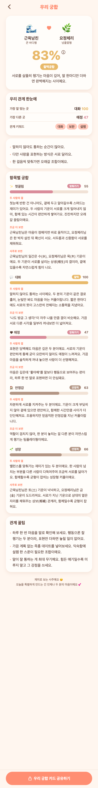

# 62 · 우리 궁합 설명 소제목 구조화

가독성 피드백을 반영해 항목 설명을 **소제목 3덩이로 구조화**했다. 문장은 하나도 줄이지
않고(전체 문구 유지), 배치만 바꿔 밀도를 낮췄다.

## 구조
각 항목 설명을 최대 3개의 소제목으로 나눈다(코럴 라벨, 배경색 없음 — 담백하게).
- **두 사람의 결** — 기본 설명
- **조금 더 보면** — 성향·행동 부연 (있을 때만)
- **사주로 보면** — 오행 근거 (있을 때만)

'사주로 보면'도 다른 소제목과 동일한 스타일(색면 없이 라벨+본문)로 통일했다.
설명이 한 덩어리뿐이면 소제목 없이 문단만 보인다.

## 서버
`CategoryScore`/`CatView`를 comment(기본)·behavior(부연)·sajuNote(오행)로 분리해 내려준다.
프론트가 각 조각에 소제목을 붙여 렌더.

*실제 화면 — 코럴 소제목으로 구조화(배경색 없음)*
