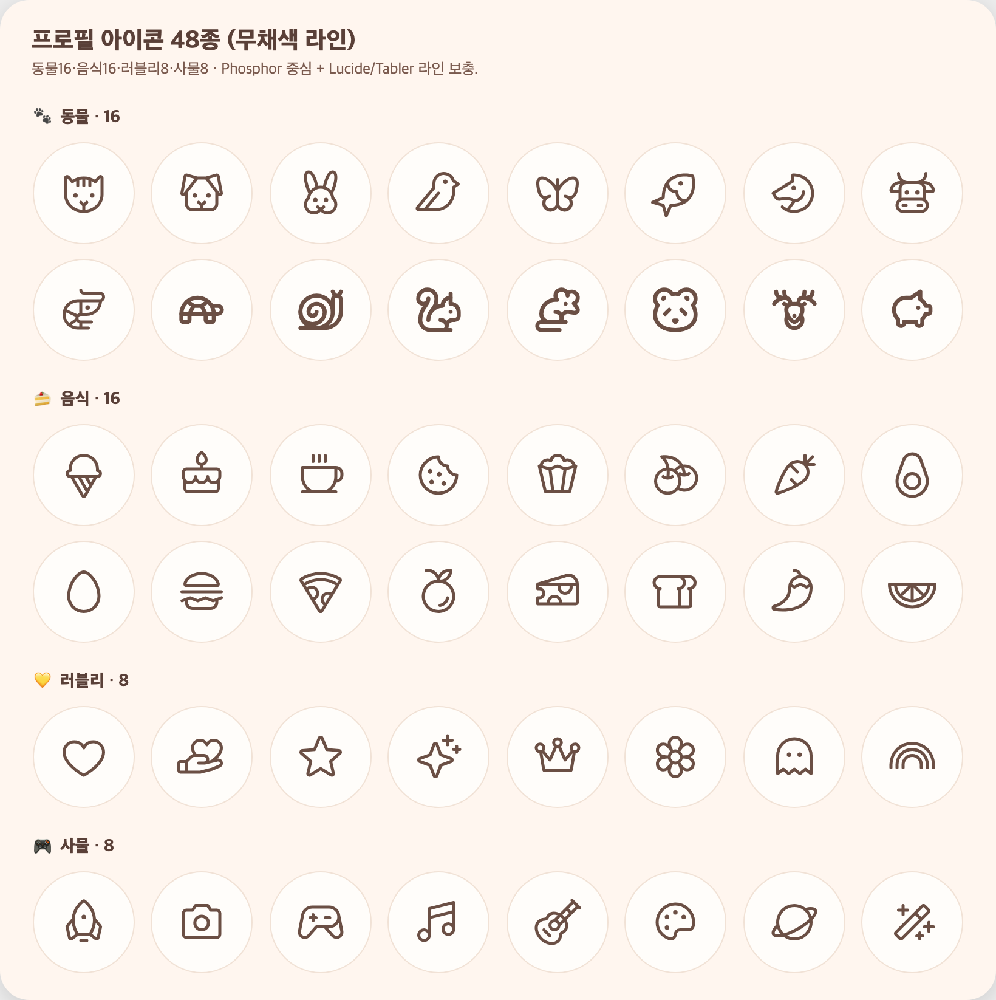
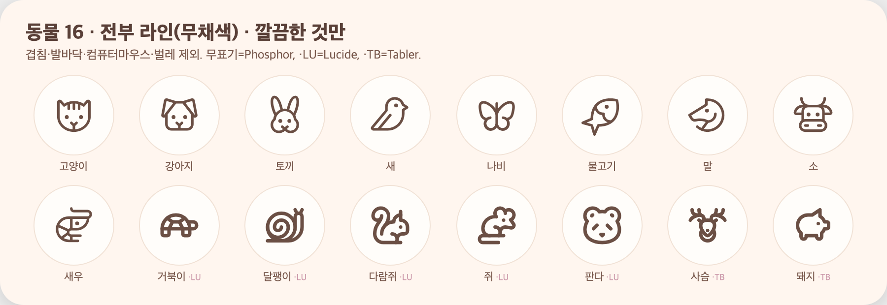

# 66 · 프로필 사진 = 무채색 라인 아이콘 48종

이모지 아바타를 걷어내고, 프로필 사진을 **무채색 라인 아이콘 48종** 중 하나를 고르는 방식으로 바꿨다.

## 구성

- 🐾 동물 16 · 🍰 음식 16 · 💛 러블리 8 · 🎮 사물 8
- 전부 무채색(브라운그레이) 라인. Phosphor를 기본으로 쓰되, 라인 동물이 부족해 Lucide(거북이·달팽이·다람쥐·쥐·판다)·Tabler(사슴·돼지)로 보충했다. 셋 다 얇은 라인이라 한 세트처럼 섞인다.
- 동물은 겹치는 것(FishSimple·BugBeetle), 발바닥(PawPrint), 컴퓨터 마우스, 벌레류를 제외하고 깔끔한 것만 골랐다.

## 구현

- `components/AvatarIcon.tsx` — `"ph:cat" | "lu:turtle" | "tb:deer"` 인코딩을 받아 해당 라이브러리 아이콘을 렌더. `isAvatarIcon()`로 구버전(이모지/이니셜)과 구분.
- `app/avatar.tsx` — 카테고리 섹션형 피커로 교체.
- 내 정보 헤더·일기 상세 아바타 렌더를 아이콘 방식으로 교체(구버전 값은 이니셜 폴백).
- 백엔드 `User.avatar` 가드를 30자로 완화(아이콘 값 대응), 컬럼 length 32.

의존성: `phosphor-react-native`, `lucide-react-native`, `@tabler/icons-react-native`(+ 기존 `react-native-svg`).
