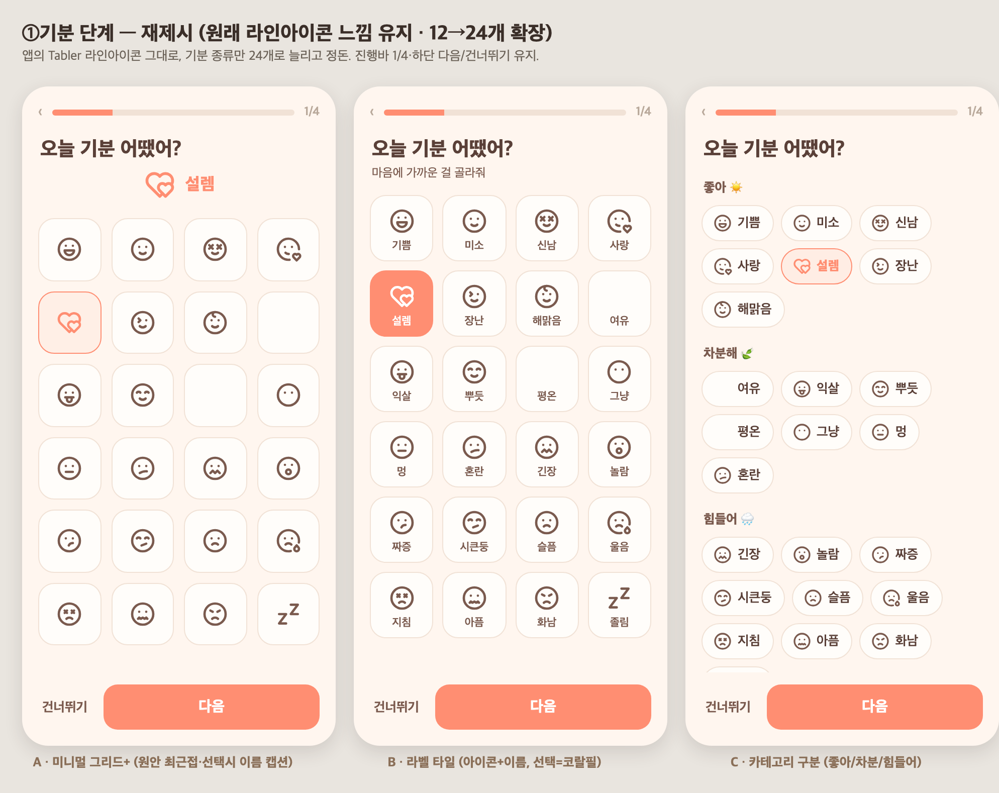
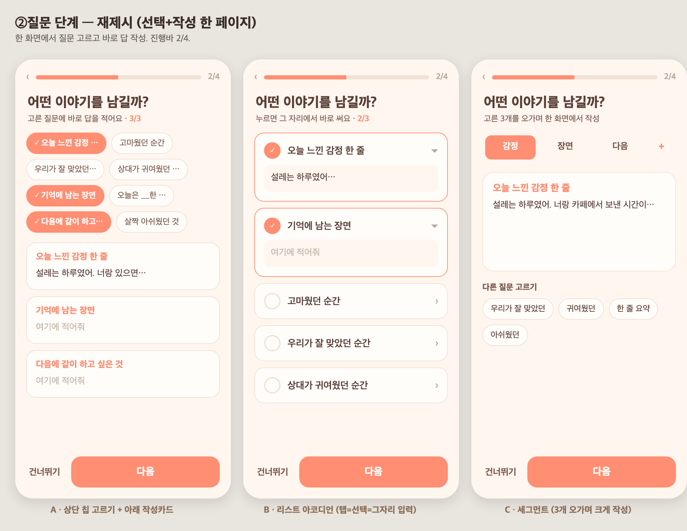
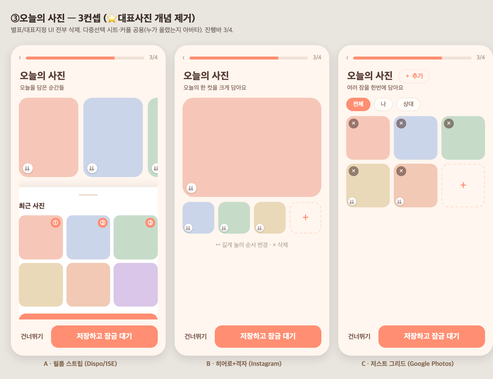
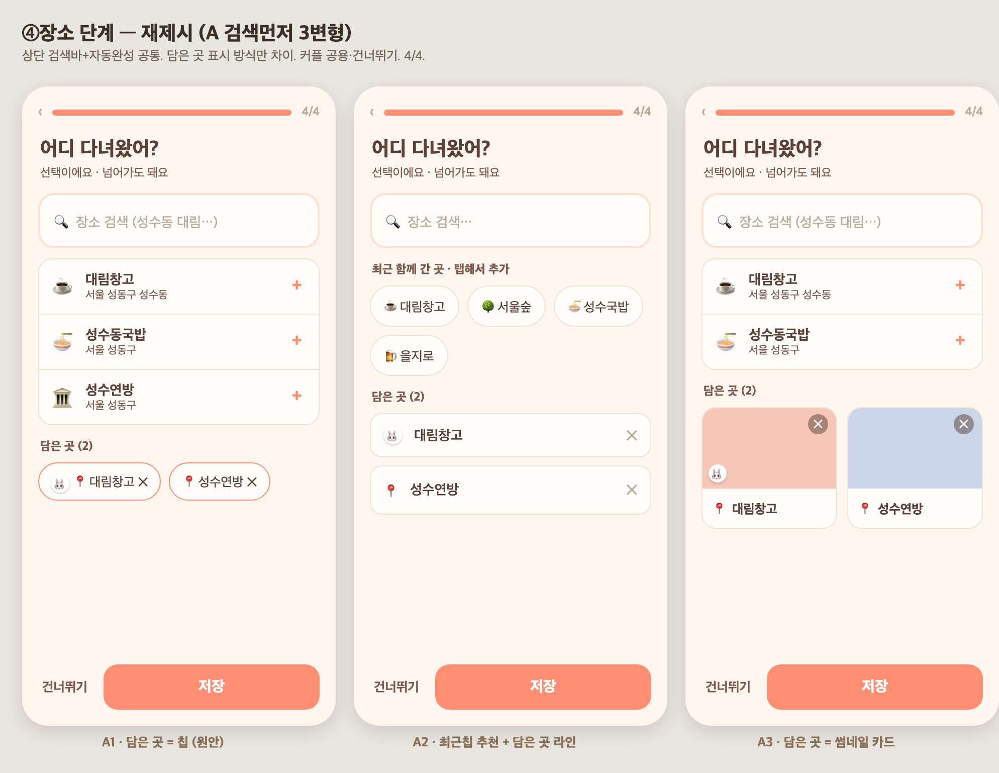

# 67 · 일기 작성 위저드 4단계 UI/UX 개편 + 대표사진 제거

일기 작성(토스식 4단계 위저드)의 각 단계를 뛰어난 레퍼런스 앱을 참고해 개선했다.
단계별로 서브에이전트가 컨셉 3개씩 제안 → 목업 비교 → 사용자가 컨셉을 골라 구현.

## 결정된 컨셉

- **①기분** → 카테고리 구분(좋아·차분·힘들어), 기분 12→**24개**로 확장. 앱의 Tabler 라인아이콘 느낌 유지.
- **②이야기(질문)** → 리스트 아코디언. 질문을 누르면 **그 자리에서 바로 답 작성**(선택=쓰기, 한 페이지). 최대 3개.
- **③오늘의 사진** → 필름 스트립(가로 스크롤). **⭐대표사진 개념 완전 삭제**, 인당 **최대 3장 / 총 6장** 제한, 누가 올렸는지 구분.
- **④어디 다녀왔어** → 검색 먼저. 상단 검색 + 최근 함께 간 곳 원탭 칩 + 담은 곳 라인 리스트.

## ①기분 (24개 · 카테고리)

## ②이야기 (선택+작성 한 페이지 아코디언)

## ③오늘의 사진 (대표사진 제거 · 인당 3장/총 6장)

## ④어디 다녀왔어 (검색 먼저)

## 구현 메모

**프론트**
- `constants/content.ts`: 기분 24개 + `cat`(good/calm/hard) + `MOOD_CATS`, `moodLabel()` 추가.
- `app/write/[date].tsx`:
  - 기분 단계 → 카테고리 섹션별 아이콘+라벨 칩.
  - 이야기 단계 `FreePickForm` → 아코디언(탭=선택+인라인 입력, 최대 3).
  - 사진 단계 → 필름 스트립, 별표/대표 UI 제거, 소유(내/상대) 표시, 인당 3·총 6 제한, 내 사진만 삭제.
  - 장소 단계 → 검색 먼저(검색 → 최근칩 → 직접입력 → 담은 곳 리스트) 순서로 재배치.
  - `repPhotoUrl` 상태·전송 제거.
- `lib/api.ts`: `PhotoView.authorId` 추가. `lib/writeDraft.ts`: `myPhotoBares` 초안 저장.

**백엔드**
- `PhotoView`에 `authorId` 추가(내/상대 사진 구분·인당 제한용).
- 대표사진(⭐) 제거: `upsert`가 `repPhotoUrl` 저장 안 함, `detail`은 항상 null, 장소 썸네일은 최근 방문일 첫 사진으로 폴백.

*목업은 설계 확정용. 실제 구현 화면은 폰 테스트로 확인.*
