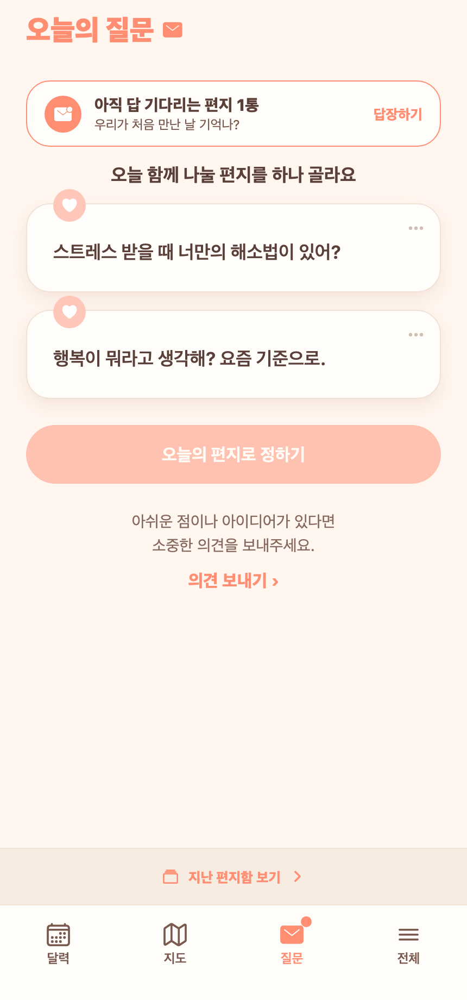
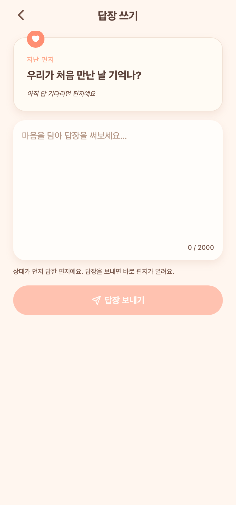

# 69 · 한 명이라도 답한 편지는 버리지 않고 '봉인 대기'로 유지

## 변경 배경
기존엔 다음 편지 시간(마감)까지 **둘 다** 답장(봉인)하지 않으면, 한 명이 답했든 아무도 안 했든 똑같이 "편지가 지나갔어요"로 마감되고 더 이상 답장할 수 없었다. 한 명의 답장이 사실상 버려졌다.

## 새 동작
- **한 명이라도 답한 편지**는 마감돼도 버리지 않고 **계속 봉인 대기**. 상대가 나중에 답하면 그때 열린다.
- 아직 안 답한 사람에게는 **오늘 편지 위 배너**("아직 답 기다리는 편지 N통")로 노출 → 탭하면 그 편지에 답장.
- **아무도 답하지 않은 편지**만 기존처럼 "편지가 지나갔어요"로 마감(알림 발송).
- '어제 편지 지나감' 힌트(missedYesterday)도 같은 기준으로 수정(한 명 답 = 지나감 아님).

## 화면 (Expo Web 캡처)

### 오늘 편지 위 '아직 답 기다리는 편지' 배너

### 배너 탭 → 지난 편지 답장 (보내면 즉시 열림)

*검증: 배너 표시 → 답장 전송 시 편지 봉인 2/2로 열림 + "편지가 열렸어요" 알림 생성 + 배너 사라짐까지 실제 확인.*

## 구현
- **백엔드**
  - `DailyQuestionRepository.findPendingLetters` — chosen·마감 지남·봉인 답 정확히 1개인 편지.
  - `assignToday`의 마감 판정: 봉인 0개(아무도 답 안 함)일 때만 `onQuestionMissed`. 1개면 유지.
  - `computeMissedYesterday`도 봉인 0개 기준으로.
  - `today()` 응답에 `pendingLetters`(내 차례인 것) 추가.
  - `answerPending(userId, date, text)` + `POST /api/questions/daily/pending/{date}/answer` — 상대가 먼저 답한 편지에 답장 → 즉시 열림.
- **프론트**
  - `question.tsx` 상단 배너, `write.tsx` pending 모드(date/q 파라미터), store `answerPending`, api 타입/메서드.
