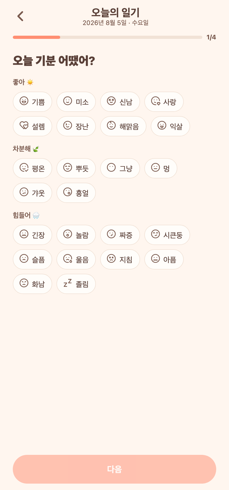
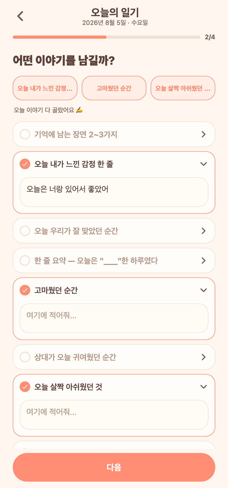
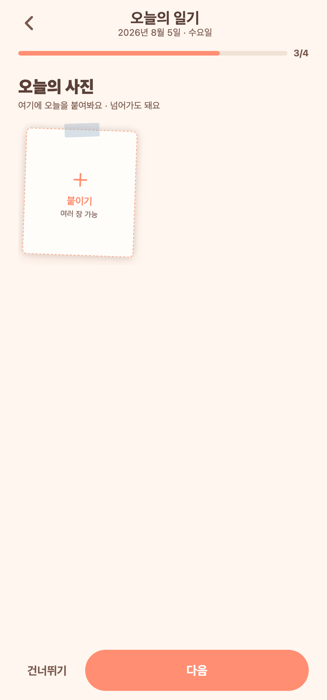

# 70 · 일기 작성 개선: 기록방식 선택 제거 + 이야기 트레이 + 사진 폴라로이드/여러 장

목업 리뷰 후 확정된 변경(달력·기분은 유지):

## 1. 기록 방식 선택 페이지 제거 → '질문 골라 쓰기' 기본
- "어떻게 기록할까요?(템플릿/질문)" 화면을 없애고, 일기 쓰기를 누르면 **바로 기분(1/4)** 으로 진입.
- 첫 작성자·모드 미정 시 자동으로 `FREE`(질문 골라 쓰기) 모드. (상대가 이미 정한 모드가 있으면 그대로 따름.)

## 2. 이야기(2/4) — 상단 3칸 트레이 + 편지지 입력
- 상단에 **"오늘의 이야기 3칸" 트레이** 고정: 고른 질문이 슬롯에 채워져 3/3 진행감이 늘 보임. 다 고르면 "오늘 이야기 다 골랐어요 ✍️".
- 답 입력창을 따뜻한 **편지지 느낌**(종이색 배경+라운드+테두리)으로.

## 3. 사진(3/4) — 폴라로이드 벽 + 여러 장 한 번에 선택
- 필름 스트립 → **폴라로이드**(흰 프레임, 살짝 기울임, 상단 테이프, "내가/상대가 담은 순간" 캡션).
- **여러 장 한 번에 선택**: `allowsMultipleSelection` + 인당 3장·총 6장 한도 내 `selectionLimit`으로 남은 만큼 골라 순차 업로드.

## 캡처 (Expo Web)

*프론트만 변경(app/write/[date].tsx). tsc 통과, 3개 화면 실제 동작 확인.*
