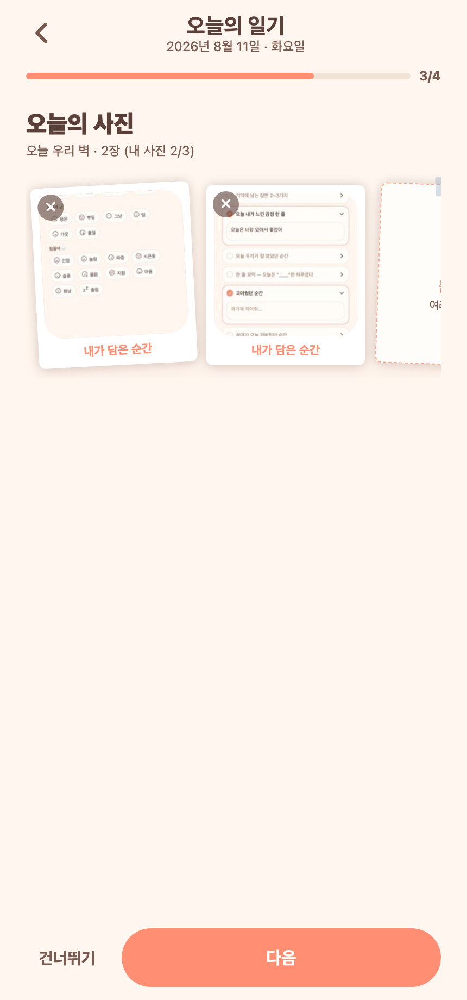

# 71 · 일기 사진 여러 장 선택 + 병렬 업로드(속도 개선)

## 변경
- **여러 장 한 번에 선택**: 일기에 사진을 넣는 두 곳 모두 다중 선택 지원.
  - 작성 위저드 사진 단계(이미 다중선택은 있었으나 순차 업로드였음).
  - **일기 상세 '함께한 사진'**(기존엔 한 장씩만) → `allowsMultipleSelection` 추가.
- **병렬 업로드(속도)**: 고른 여러 장을 순차가 아니라 **동시에** 업로드해 대기시간 단축.
- 한도: 작성=인당 3장·총 6장, 상세=총 6장. 남은 만큼 `selectionLimit`으로 제한.

## 구현
- `lib/photoUpload.ts` 신설:
  - `resizeAndUploadAsset(asset)` — 리사이즈(≤1440)·압축(0.7) 후 업로드, 실패 시 null.
  - `uploadAssetsParallel(assets)` — `Promise.all`로 병렬 업로드, 성공 url 배열+실패 수 반환.
- `app/write/[date].tsx`·`app/entry/[date].tsx`가 이 헬퍼를 공유(중복 제거). 순차 for-loop → 병렬.

## 검증 (Expo Web)
2장을 한 번에 골라 둘 다 병렬 업로드 → "오늘 우리 벽 · 2장 (내 사진 2/3)".

*프론트만 변경. tsc 통과, 작성 화면 실제 동작 확인(상세는 동일 헬퍼).*
