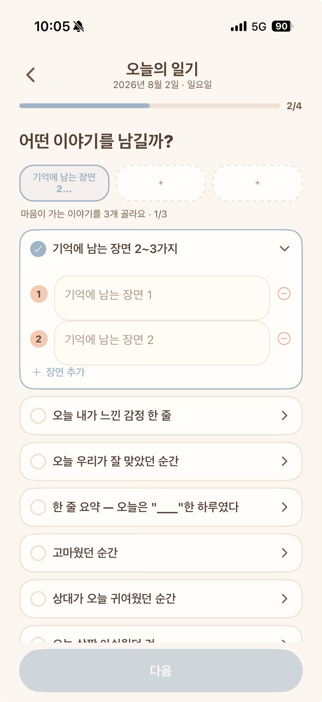
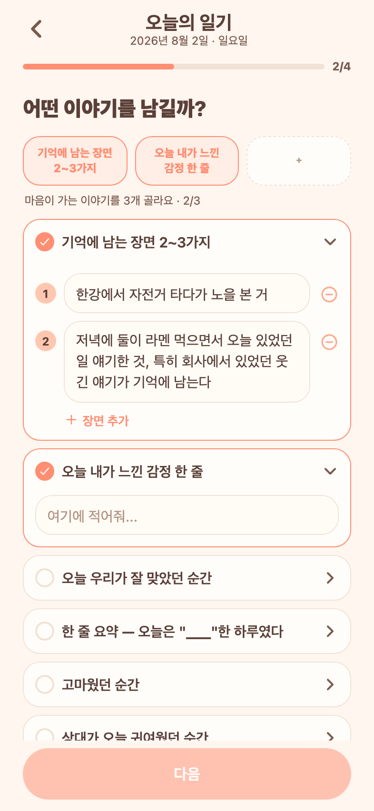
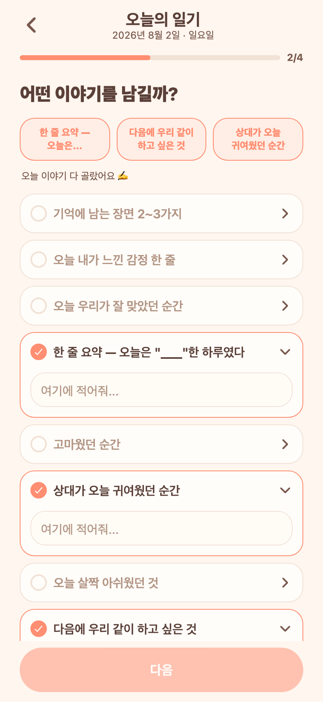

# 72 · 이야기 단계 입력 카드 깨짐 정리

폰에서 "입력쪽 카드 UI가 살짝 깨진다"는 제보 → 작성 위저드 2단계(이야기)에서 세 가지가 겹쳐 있었다.

## 문제

*수정 전 — 트레이 칩 글자가 "2..."로 끊기고, 빈 입력칸끼리 높이가 다르며 번호 뱃지가 첫 줄과 어긋난다.*

1. **트레이 칩 글자 깨짐** — 질문 이름을 11자에서 무조건 자르고 있어 "기억에 남는 장면 2…"처럼 어색하게 끊겼다. 안 자른 경우에도 한글은 글자 단위로 줄바꿈돼 "느낀 감 / 정 한 줄"이 됐다.
2. **입력칸 높이가 제각각** — 빈 칸인데도 칸마다 높이가 달랐다. 높이를 두 곳(자동확장 값 + 스타일 `minHeight`)에서 정하고 있었고, 두 값의 기준이 플랫폼마다 달라 어긋났다.
3. **번호 뱃지·삭제 버튼이 첫 줄과 어긋남** — 칸이 필요 이상으로 높아 뱃지가 글자와 안 맞았고, "장면 추가"도 입력칸 왼쪽 선과 어긋나 있었다.

## 변경

- 트레이 칩: 글자수 자르기 제거 → **어절 단위로 2줄**까지 채우고 넘치면 말줄임. 칩 높이는 고정(52)이라 채워진 칸과 빈 칸 높이가 같다.
- 입력칸 높이는 **한 곳에서만** 결정(빈 칸 = 한 줄 높이 42, 내용 늘면 자동 확장). 같은 빈 칸끼리 항상 같은 높이.
- 번호 뱃지·삭제 버튼을 입력 첫 줄 중앙에 맞추고, "장면 추가"를 입력칸 왼쪽 선에 맞춰 들여썼다.

## 검증 (Expo Web)

*빈 칸·채운 칸 모두 높이가 일정하고, 여러 줄로 늘어나도 번호 뱃지가 첫 줄에 붙어 있다. 트레이 칩은 "오늘 내가 느낀 / 감정 한 줄"로 어절 단위 줄바꿈.*

*가장 긴 질문들을 골라도 칩이 넘치지 않고 "한 줄 요약 — / 오늘은…"으로 정리된다.*
