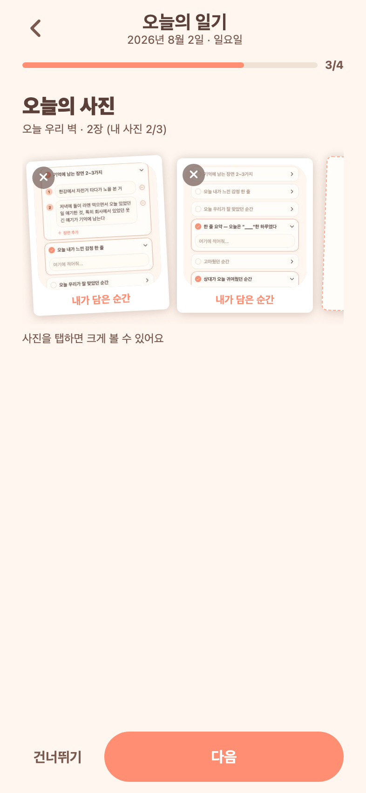
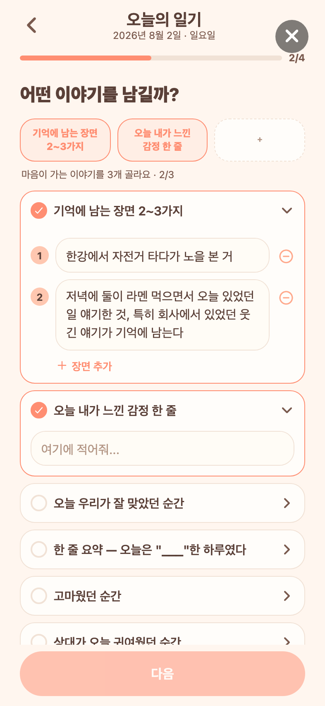

# 73 · 작성 중에도 사진 크게 보기

일기 작성 위저드 3단계(사진)에서 붙인 사진을 **탭하면 풀스크린으로** 볼 수 있게 했다. 지금까지는 일기 상세에서만 가능했고, 작성 중에는 132px 폴라로이드 썸네일이 전부였다.

## 변경
- 폴라로이드 사진을 탭 → 풀스크린 뷰어. **좌우 스와이프로 다른 사진**, 아래로 밀면 닫힘, 저장 버튼(앱에서만).
- 사진이 하나라도 있으면 "사진을 탭하면 크게 볼 수 있어요" 안내를 아래 붙였다.
- 삭제(✕)·상대 표시 배지는 그대로 — 탭은 크게 보기, ✕는 삭제로 나뉜다.

## 구현
- 일기 상세(`app/entry/[date].tsx`)에만 있던 풀스크린 뷰어를 `components/PhotoViewer.tsx`로 **추출해 공용화**(상세·작성이 같은 컴포넌트를 쓴다). 상세 쪽 중복 코드와 전용 스타일은 제거.
- 작성 화면은 `viewer` 상태만 들고 폴라로이드 `onPress`에서 열어 준다.

## 검증 (Expo Web)

*사진을 붙이면 아래에 "사진을 탭하면 크게 볼 수 있어요" 안내가 나온다.*

*썸네일을 탭하면 화면 전체로 열린다(검증용으로 올린 이미지라 화면 캡처가 그대로 보인다). 웹에서는 저장 버튼이 숨겨지고 앱에서만 나온다.*
