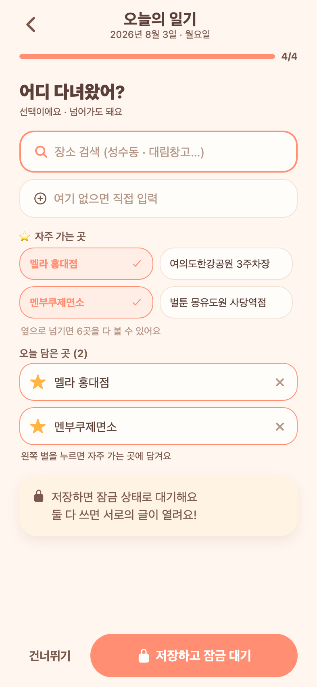
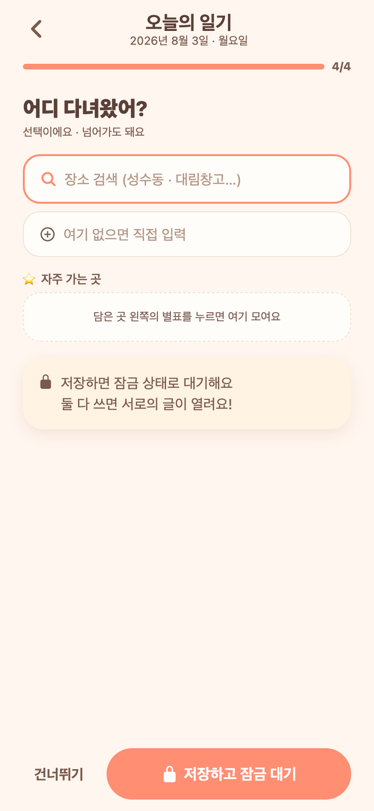
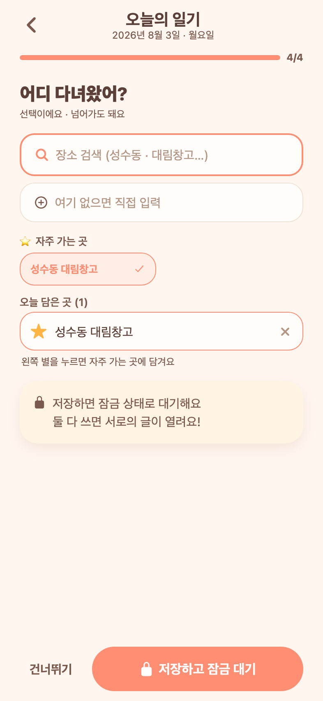

# 74 · 장소 고르기: 최근 간 곳 대신 '자주 가는 곳(즐겨찾기)'

일기 4단계 장소 화면에서 **최근 간 곳 칩 목록을 없애고**, 커플이 직접 별표로 담아둔 **즐겨찾기**만 보여준다.

## 왜 바꿨나

실제 DB를 뒤져 보니(일기 39개·7커플, 테스트 데이터가 섞여 있어 참고용):

- 일기에 적히는 장소의 **87~100%가 처음 가는 곳**이고, 재방문은 13% 이하.
- **직전에 간 곳을 다음 일기에 또 적은 경우는 0건**(연속 전환 10건 중).
- 즉 "최근 간 곳"을 최근순으로 깔아두는 건 이번에 갈 곳과 거의 상관이 없다. 반면 늘 가는 몇 곳은 매번 다시 입력하게 되고, "대림창고갤러리 / 성수동 대림창고 갤러리"처럼 이름이 쪼개진다(좌표 없는 텍스트 입력이 24%).

그래서 자동 추천 대신 **직접 고정해 둔 곳**만 남겼다.

## 변경

- 화면 순서를 **검색 → 직접 입력 → 자주 가는 곳 → 오늘 담은 곳**으로 정리.
- **자주 가는 곳**: 한 판에 4곳(2열 2행), 넘치면 옆으로 넘겨서 본다. 곳이 늘어도 화면이 세로로 길어지지 않는다. 아이콘 없이 이름만 얇게.
- **오늘 담은 곳**: 왼쪽 별표를 누르면 그 자리에서 즐겨찾기에 담기고 해제된다. 밀어서 삭제하던 방식은 ✕ 버튼으로 바꿨다.
- 즐겨찾기가 하나도 없으면 별표로 담는 방법을 안내한다.

## 구현

- 백엔드: `place_favorites` 테이블(커플 공용, 커플+이름 유니크) 신설. `GET /api/locations` 응답에 `favorites` 추가, `PUT /api/locations/favorite`로 등록·해제. 계정 삭제 시 함께 정리.
- 프론트: `locationApi.setFavorite`, 작성 화면에 가로 페이징 `FavoritePager`. 별표는 먼저 화면에 반영하고 실패 시 되돌린다.

## 검증 (Expo Web)

*자주 가는 곳에서 두 곳을 담은 모습. 담은 곳은 아래에 쌓이고 왼쪽 별이 채워져 있다.*

*처음에는 담는 방법만 안내한다.*

*직접 입력한 "성수동 대림창고"의 별을 누르자 바로 자주 가는 곳에 올라왔다(DB에도 저장 확인).*
