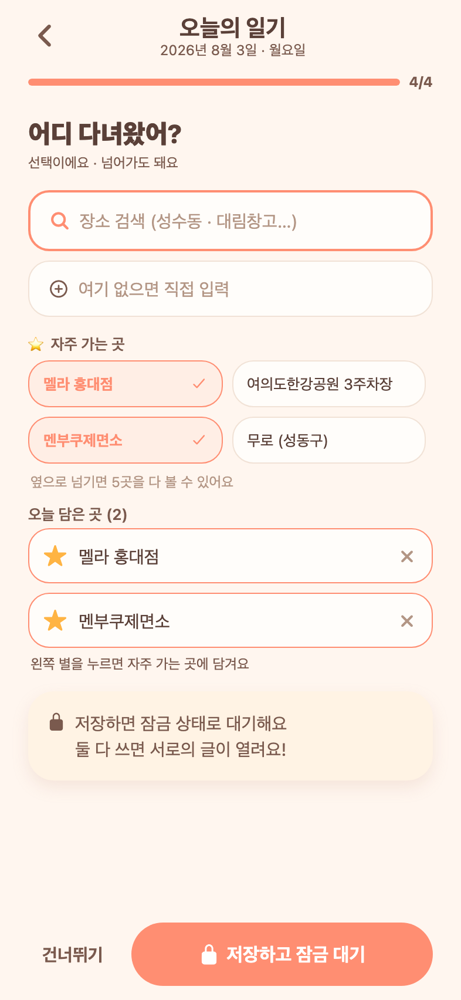

# 75 · 이름이 같은 다른 지점이 한 곳으로 묶이던 문제

같은 상호의 두 지점(예: "무로" 성수점·사당점)을 담으면 **둘 다 같이 담기고 둘 다 같이 취소**됐다.

## 원인

장소를 **이름 문자열로만** 식별하고 있었다.

- 지도 피커의 `sameName(a, b)`가 이름만 비교 → 검색 결과에 같은 이름이 둘 있으면 하나를 담는 순간 둘 다 "담김"으로 표시되고, 하나를 빼면 둘 다 빠졌다.
- 확정할 때도 이름으로 중복을 걸러 두 지점 중 하나만 남았다.
- 서버도 장소를 이름으로 저장하므로, 설령 둘 다 담겨도 나중에 구분할 수 없었다.

## 변경

- **고르는 동안에는 좌표로 구분한다.** 좌표가 있으면 좌표(소수점 5자리 ≈ 1m)를 식별키로 쓴다. 이름이 아니라 좌표를 기준으로 삼은 이유는, 담은 뒤 이름 뒤에 지역이 붙어도 지도를 다시 열었을 때 "이미 담긴 곳"으로 그대로 인식돼야 하기 때문이다.
- **저장할 이름은 서로 다르게 만든다.** 담은 목록 안에 같은 이름이 둘 이상이면 주소에서 지역을 뽑아 "무로 (성동구)" / "무로 (관악구)"로 붙인다. 지역까지 같으면 뒤에 순번을 붙인다. 이름이 겹치지 않으면 원래 이름 그대로 둔다.
- 같은 좌표를 두 번 담은 건 한 곳으로 합친다(이때는 지역을 붙이지 않는다).
- 기존에 저장된 일기를 다시 열 때도 같은 정리를 적용해, 예전에 한 이름으로 뭉쳐 저장된 곳도 화면에서는 구분된다.

## 구현

- `lib/places.ts` 신설 — `placeKey`(좌표 우선 식별키) · `areaHint`(주소에서 지역 추출) · `mergePickedPlaces`(중복 제거 + 이름 구분). 지도 피커와 작성 화면이 함께 쓴다.

## 검증

지도 피커는 WebView라 웹 캡처로 확인할 수 없어, 분리한 로직을 케이스별로 직접 돌려 확인했다(11개 전부 통과).

- 같은 이름 다른 좌표 → 키가 다르고 이름이 "무로 (성동구)" / "무로 (관악구)"로 갈린다
- 담은 뒤 이름이 바뀌어도 좌표가 같으면 같은 곳으로 인식된다
- 같은 좌표를 두 번 담으면 한 곳으로 합쳐지고 이름은 그대로 "무로"
- 이름이 겹치지 않으면 손대지 않는다
- 주소에서 도로명("성수이로")·번지는 걸러지고 동이 있으면 동을 쓴다

*"무로 (성동구)"와 "무로 (관악구)"가 각각 별개 항목으로 담긴다.*
