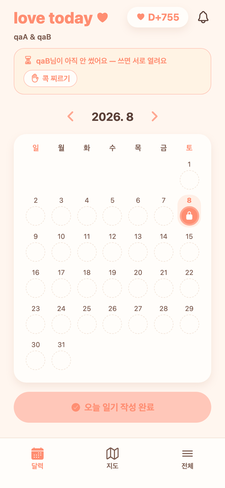
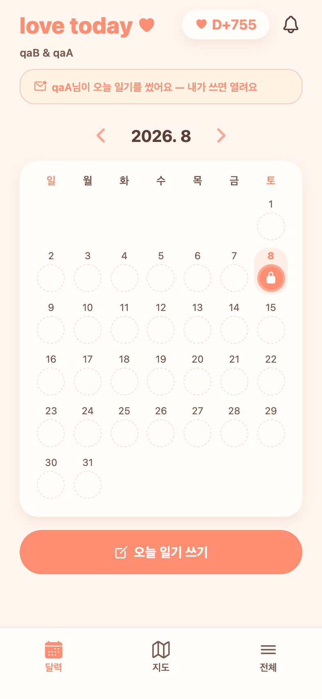

# 76 · 콕 찌르기는 오늘 쓴 사람만

콕 찌르기 조건이 반대로 걸려 있었다. **상대가 쓰고 내가 안 썼을 때 내가 상대를 찌를 수 있었다** — 재촉받아야 할 쪽은 나인데도.

## 변경

- **내가 안 썼으면 콕 찌르기가 안 보인다.** 홈의 "상대가 오늘 일기를 썼어요" 배너와 일기 상세의 잠긴 카드에서 찌르기 버튼을 뺐다. 이 화면에서 할 일은 내 일기를 쓰는 것뿐이다.
- **내가 썼고 상대가 안 썼을 때 찌를 수 있다.** 홈에 "상대님이 아직 안 썼어요 — 쓰면 서로 열려요" 배너를 새로 두고 거기에 찌르기를 붙였다. 상세의 "상대가 아직 안 썼어요" 카드에도 붙였다.
- **서버에서도 막는다.** 오늘 내 일기가 없으면 `POST /api/poke`가 403(`D004 오늘 일기를 쓴 뒤에 콕 찌를 수 있어요`)을 준다. 기존 1시간 스팸 방지는 그대로.

## 검증

서버(실제 호출):

- 오늘 쓴 사람이 찌르기 → 200
- 안 쓴 사람이 찌르기 → 403 `D004`

화면(Expo Web, 커플 두 계정 각각):

*내가 쓴 쪽 — "qaB님이 아직 안 썼어요" 배너와 함께 콕 찌르기가 나온다.*

*내가 안 쓴 쪽 — 안내만 있고 콕 찌르기는 없다.*

일기 상세도 같은 규칙으로 동작하는 것을 두 계정에서 확인했다(쓴 쪽은 대기 카드에 찌르기 노출, 안 쓴 쪽은 잠긴 카드에 "내 일기 쓰기"만).
