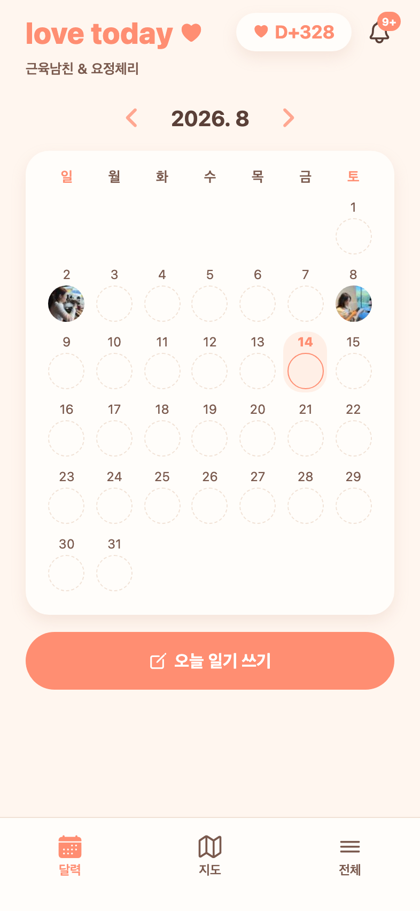

# 77 · 알림 조회가 죽어 "데이터가 날아간 것처럼" 보이던 장애

로그인은 되는데 홈이 비어 보여 데이터가 사라진 줄 알았던 건이다. **데이터는 멀쩡했고, 알림 조회가 500을 내고 있었다.**

## 원인

`8d51a77`에서 "오늘의 질문" 기능을 걷어내면서 `NotificationType` enum의 `QUESTION_*` 값들을 지웠는데, **DB `notifications` 테이블에는 그 값이 그대로 남아 있었다**(1,665건).

```
No enum constant com.today.notification.NotificationType.QUESTION_ARRIVED
```

Hibernate가 알림을 읽다 모르는 값을 만나 예외를 던져, 알림이 하나라도 있는 계정은 `GET /api/notifications`가 항상 500이었다. 실제 커플 계정 두 명 모두 해당 알림을 29건씩 갖고 있었다.

기능 제거 커밋이 **코드에서만 값을 없애고 남아 있는 데이터는 손대지 않은 것**이 화근이다. enum을 좁힐 때는 저장된 값도 같이 정리해야 한다.

## 조치

- `notifications` 테이블을 먼저 덤프해 두고(`backups/`, git 제외), 사라진 기능의 알림만 삭제했다 — `QUESTION_ARRIVED`(806) · `QUESTION_MISSED`(756) · `QUESTION_COMMENT`(36) · `QUESTION_OPENED`(31) · `QUESTION_CHOSEN`(18) · `QUESTION_ANSWERED`(18) = **1,665건**.
- 일기·사진·장소·커플 데이터는 손대지 않았다.

## 확인

앱이 실제로 쓰는 엔드포인트를 커플 두 계정으로 전부 호출해 200을 확인했다(`/api/couple`, `/api/notifications`, `/api/entries`, `/api/entries/{date}`, `/api/calendar-marks`, `/api/locations`, `/api/saju/*`, `/api/notification-settings`).



*8월 2일·8일 일기가 사진 썸네일과 함께 그대로 있다. 콘솔 에러도 없다.*

일기 상세도 장소(후탄·나이스타임 남양주점·화포식당 다산신도시점)와 답변까지 온전했다.

## 남은 것

- `GET /api/questions/today`가 아직 500을 낸다. 제거된 기능의 잔재 엔드포인트로 **앱은 호출하지 않아** 사용자 영향은 없지만, 서버 로그를 계속 더럽히므로 정리 대상이다.
- 오늘 Apple 로그인으로 빈 계정 하나가 새로 생겼다(커플·일기 없음). 카카오로 로그인하면 기존 계정으로 정상 접속되므로 그대로 두기로 했다.
