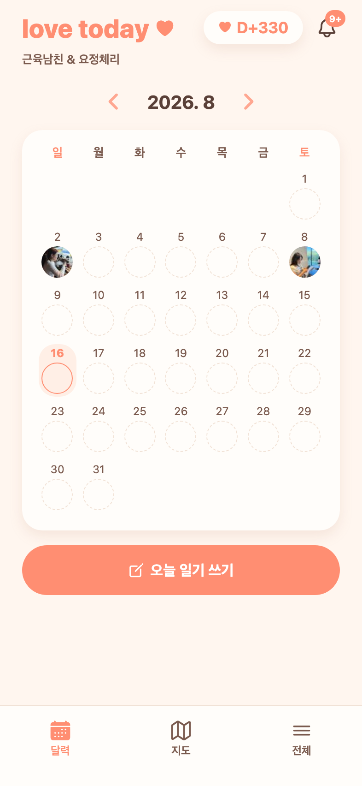

# 78 · 서버에 못 닿았을 뿐인데 "커플 연결" 화면이 뜨던 문제

카카오로 로그인했더니 커플 연결 화면 + "코드를 불러오지 못했어요"가 떠서 데이터가 날아간 줄 알았던 건. **데이터는 멀쩡했고, 서버에 잠깐 못 닿은 걸 앱이 "커플 없음"으로 단정한 것**이었다.

## 원인

접속 실패와 "정말 커플이 없음"을 구분하지 않고 있었다. 세 군데 모두 실패를 곧장 '없음'으로 확정했다.

- `kakaoLogin`/`appleLogin`: 로그인 성공 직후 내 정보 조회가 실패하면 `catch {}`로 **조용히 무시** → `coupled`가 초기값 false로 남음.
- 라우팅 가드: 그 false만 보고 커플 연결 화면으로 보냄.
- `useCoupleStore.refresh`: 조회 실패 시 `couple: null, loaded: true`로 저장 → 확인된 '없음'처럼 취급.

결과적으로 서버가 잠깐만 안 되면 기록이 사라진 것처럼 보였다. (당시 서버 로그에는 그 시각 요청 기록 자체가 없었다 — 맥 절전이나 터널 끊김으로 요청이 닿지 않았다.)

## 변경

- 인증 상태에 **`offline`을 추가**했다 — 토큰은 있는데 서버에 못 닿아 **커플 여부를 모르는** 상태. 401(진짜 만료)일 때만 로그아웃하고, 네트워크·5xx는 offline로 둔다.
- 소셜 로그인 직후 내 정보 조회가 실패하면 무시하지 않고 offline로 넘긴다.
- offline이면 **라우팅을 아예 하지 않는다**(커플 연결 화면으로 튕기지 않음). 대신 "연결 상태를 불러오지 못했어요 · 기록은 그대로 있으니 잠시 후 다시 시도해 주세요" 안내와 재시도 버튼을 보여준다.
- offline인 동안 **5초마다 스스로 다시 붙는다.** 서버가 돌아오면 사용자가 아무것도 안 해도 원래 화면으로 복귀한다.
- 커플 조회 실패를 '커플 없음'으로 저장하지 않는다(알던 값이 있으면 유지).

## 검증 (Expo Web)

백엔드로 가는 요청을 전부 끊어 실제 장애를 재현했다.

*커플 연결 화면 대신 안내가 뜬다.*

*요청을 다시 통과시키자 버튼을 누르지 않아도 홈으로 돌아온다(근육남친 & 요정체리, D+330).*
