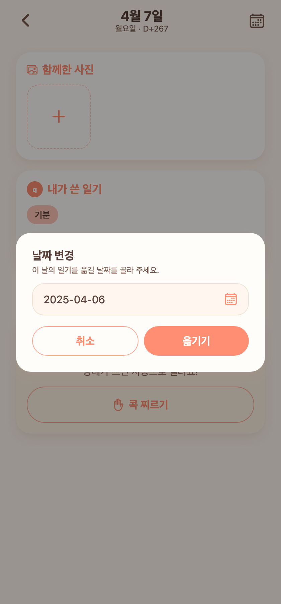
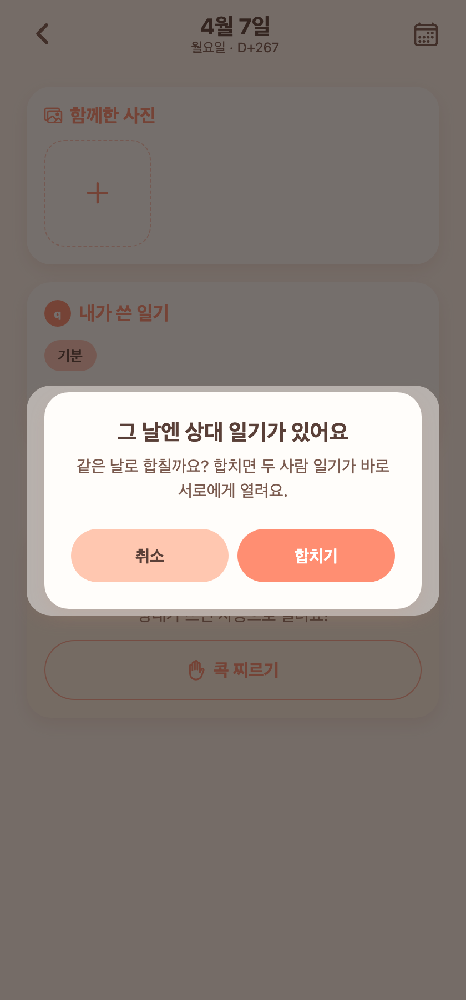
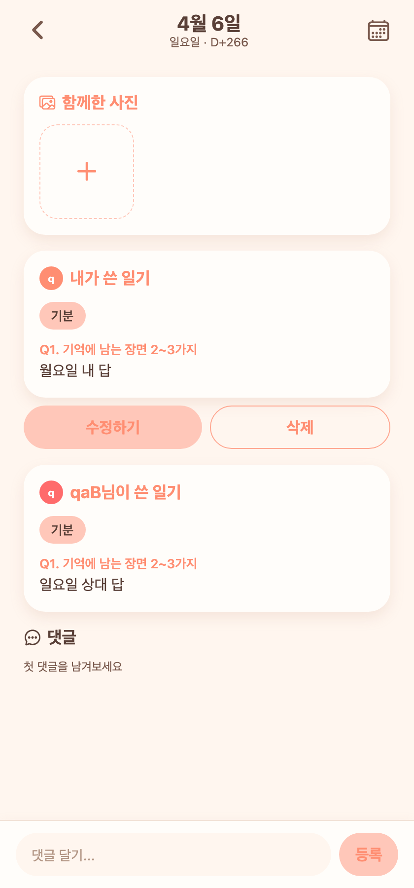

# 80 · 날짜 변경: 창이 안 열리던 문제와, 상대 일기가 있는 날로 합치기

일기 상세의 **날짜 변경**이 두 가지로 막혀 있었다. 창을 눌러도 날짜를 못 고르고, 정작 날짜를 바꿔야 하는 상황에서 서버가 이동을 거절했다.

## 1) 날짜 선택 창이 안 열리고, 취소해도 화면이 죽던 문제

"날짜 변경" 확인창에서 `날짜 선택`을 눌러도 달력이 뜨지 않았고, 취소로 빠져나온 뒤에는 화면 전체가 눌리지 않았다.

원인은 **팝업 창 두 개를 나란히 띄운 구조**다. iOS에서는 팝업 위에 다른 팝업을 형제로 겹쳐 띄우면 두 번째가 표시되지 않고, 닫힌 뒤에도 보이지 않는 층이 남아 터치를 전부 먹는다.

- 확인창은 팝업이 아니라 **화면 안 오버레이**로 바꿨다. 이제 달력만 진짜 팝업이라 겹칠 일이 없다.
- 웹에서 열기 → 달력 → 날짜 선택 → 취소 → 재오픈까지 실제로 확인했다.

*확인창(오버레이) 위로 달력이 정상적으로 열리고, 고른 날짜가 필드에 반영된다.*

## 2) 상대가 이미 쓴 날로는 옮길 수 없던 문제

검증 시나리오: 상대가 **일요일**에 일기를 씀 → 내가 실수로 **월요일**에 씀 → 내 일기를 일요일로 옮김.

기존 동작은 이 상황에서 `그날에는 이미 일기가 있어요`(409)로 **이동 자체를 거절**했다. 날짜 변경이 가장 필요한 경우(내가 날짜를 잘못 골라 썼고 상대는 제대로 쓴 경우)가 유일하게 막혀 있던 셈이다.

### 변경

- 옮길 날에 **상대 일기만 있으면 같은 날로 합친다.** 합치면 두 사람이 모두 쓴 상태가 되어 **그 자리에서 서로에게 열리고**, 상대에게도 "일기가 열렸어요" 알림이 간다.
- 실수로 합치는 걸 막기 위해 옮기기 전에 한 번 묻는다.
- 합칠 때 그날의 사진·다녀온 장소도 함께 따라가며, 비게 된 원래 날짜는 사라진다.

*"합치기"를 누르면 일요일로 이동하고, 두 사람 일기가 바로 열린다.*

### 그대로 막는 경우

합칠 수 없는 상황은 이유를 구분해 안내한다.

| 상황 | 안내 |
| --- | --- |
| 옮길 날에 이미 내 일기가 있음 | 그날에는 이미 일기가 있어요 |
| 두 사람이 함께 쓴 날을, 일기가 있는 다른 날로 | 두 사람이 함께 쓴 날이라 다른 날로 합칠 수 없어요 |
| 옛 기록 방식(자유 서식)과 지금 방식이 다름 | 기록 방식이 달라 그날과 합칠 수 없어요 |

## 검증

테스트 커플 계정으로 실제 서버에 붙여 확인했다.

- 상대만 쓴 날로 이동 → 합쳐지고 양쪽 모두 열림, 원래 날짜는 빈 날이 됨, "일기가 열렸어요" 알림 생성
- 빈 날짜로 이동 → 기존처럼 통째로 이동(함께 쓴 날 포함)
- 함께 쓴 날 → 일기 있는 날 이동 / 내 일기 있는 날로 이동 → 각각 안내 문구대로 거절
- 웹 화면에서 확인창 → 달력 → 합치기 확인 → 이동 완료까지 전 구간 캡처

날짜 선택 창이 안 열리던 건 iOS 전용 증상이라, 실기기 확인은 다음 빌드에서 한 번 더 필요하다.
