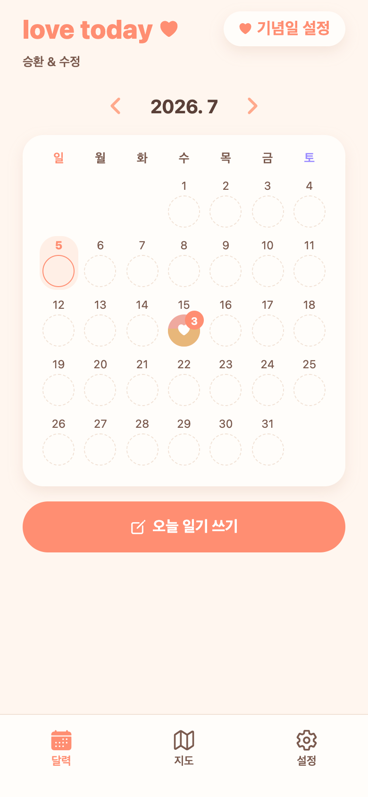
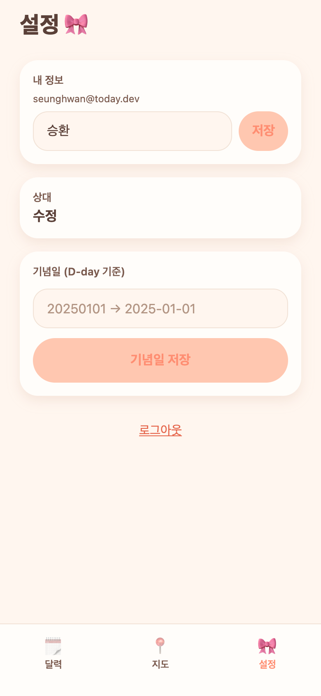

# 개발 로그 (devlog)

투데이(커플 교환일기) 개발 진행 로그. 요청·작업 단위로 넘버링해서 기록한다.

| # | 날짜 | 내용 |
|---|------|------|
| [01](01-planning-mockups.md) | 2026-07-04 | 기획·목업 스토리보드 (색/구조 방향 결정) |
| [02](02-mvp-implementation.md) | 2026-07-04 | 1차 구현 — Spring Boot + Expo 핵심 루프 |
| [03](03-integration-fix.md) | 2026-07-04 | 프론트↔백엔드 API 계약 정합(통합 버그) |
| [04](04-remote-tunnel.md) | 2026-07-04~05 | 원격 실행 — Cloudflare 터널 고정 URL |
| [05](05-qa-photo-upload.md) | 2026-07-05 | QA(서브에이전트) + 버그 수정 + 실제 사진 업로드 |
| [06](06-sdk54-expo-go.md) | 2026-07-05 | Expo SDK 57→54 다운그레이드(Expo Go 호환) |
| [07](07-login-branding-emoji.md) | 2026-07-05 | 로그인 닉네임만 + love today + 이모지 정리 |
| [08](08-vector-icons.md) | 2026-07-05 | UI 전면 벡터 아이콘화(기본 이모지 제거) |
| [09](09-notifications-ux-batch.md) | 2026-07-05 | 인앱 알림 + 캐싱/새로고침 + 다수 UX개선·버그수정 |
| [10](10-date-anniv-colors-map.md) | 2026-07-05 | 날짜변경·기념일보기·로그인TTL·색상테마·키패드 + 지도목업 |
| [11](11-map-kakao.md) | 2026-07-05 | 지도 구현 — Kakao 키 발급·도메인 등록·카카오맵 활성화 + 렌더 검증 |
| [12](12-themed-popup-datepicker.md) | 2026-07-05 | 앱 톤 커스텀 팝업 + 캘린더 날짜 피커(생일·기념일·날짜변경) |
| [13](13-place-search.md) | 2026-07-05 | 일기 작성 — 카카오맵 장소 검색(백엔드 프록시 + 검색 시트) |
| [14](14-write-draft-restore.md) | 2026-07-05 | 작성 복귀 백지/리셋 버그 — 초안 자동저장·복원 |
| [15](15-place-add-mockups.md) | 2026-07-05 | 장소 추가 3안 목업(추천 B+C) + 검색 시트 백그라운드 복귀 버그 수정 |
| [16](16-kakao-login-and-map-pick.md) | 2026-07-05 | 카카오 실로그인 완성(Client Secret/KOE010) + 지도에서 장소 콕 찍어 담기(15a) |
| [17](17-feedback-images-settings-revamp.md) | 2026-07-05 | 피드백 이미지 첨부(3장)·FAB 고정·저장 토스트·스와이프 닫기·홈 작성완료·설정 애플 스타일+내정보 그룹 |
| [18](18-profile-photo-color-unify.md) | 2026-07-05 | 프로필 사진 추가/변경/삭제·색상 앱컬러 통일·저장 토스트/스와이프 수정(병렬 에이전트) |
| [19](19-place-detail-calendar-marks.md) | 2026-07-06 | 지도 장소 상세(별명·일기 모음)·기념일 캘린더 작은 점 표시·색상 통일(병렬 에이전트) |
| [20](20-mood-emoji-images-cleanup.md) | 2026-07-06 | 기분 이모지·별점 제거·이미지 로딩(캐시+리사이즈+썸네일)·리포트 제거·캘린더 4안 |

## 현재 앱 화면 (SDK54, 실제 동작 캡처)
| 로그인 | 홈(캘린더) | 상세(상호공개) |
|---|---|---|
|  |  |  |

| 작성(모드선택) | 설정 |
|---|---|
|  |  |

## 운영 메모 (현재)
- 백엔드 `https://today-api.hammerslog.trade`(→8083), 웹 `https://today-web.hammerslog.trade`(→8087), Expo Go `exp://today-expo.hammerslog.trade`(→Metro 8088). MySQL `today`@3307.
- cloudflared named 터널은 root 데몬 → config 변경 시 `sudo launchctl kickstart -k system/com.cloudflare.cloudflared` 필요.
